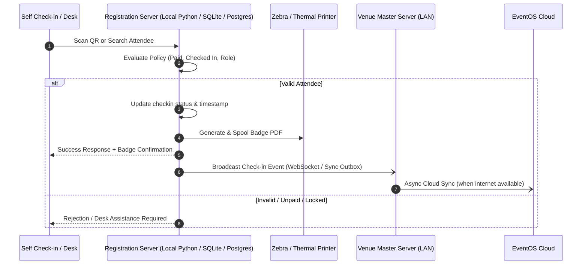

# EventOS Venue Registration Software: Detailed Component & Workflow Walkthrough

## 1. System Architecture & Foundation

The EventOS Venue Registration Software ([apps/venue/registration](file:///d:/DEV/conf-platform/apps/venue/registration)) is a unified desktop & web application designed for on-site conference management. It supports high-throughput check-ins, instantaneous badge printing, dynamic registration forms, multi-station QR access control, companion linkages, and kit distribution.

### Core Architecture Layers:
1. **Electron Host Layer ([electron/main.ts](file:///d:/DEV/conf-platform/apps/venue/registration/electron/main.ts))**:
   - Manages window lifecycle, IPC handlers, OS sandbox, and file dialogs.
   - Automatically bootstraps the local Python backend ([services/registration-server](file:///d:/DEV/conf-platform/services/registration-server)) and SQLite / PostgreSQL engines.
   - Directs external URLs to default OS browser while isolating badge PDF previews into internal frameless preview windows.
   - Encrypts database secrets with Windows DPAPI / Electron `safeStorage`.

2. **Frontend App Router ([app](file:///d:/DEV/conf-platform/apps/venue/registration/app))**:
   - Next.js 16 App Router segmented into 4 operational layouts: `/registry`, `/scanning`, `/self-checkin`, and `/admin`.
   - Workstation assignment validation via [lib/node-workstation.ts](file:///d:/DEV/conf-platform/apps/venue/registration/lib/node-workstation.ts).

3. **State & Network Engines**:
   - [store/use-auth-store.ts](file:///d:/DEV/conf-platform/apps/venue/registration/store/use-auth-store.ts): Controls active mode (`registration`, `scanning`, `self_checkin`, `admin`), JWT tokens, operator credentials, and session state.
   - [lib/api-client.ts](file:///d:/DEV/conf-platform/apps/venue/registration/lib/api-client.ts): Axios client with interceptors for offline detection, automatic bearer tokens, and error normalizing.
   - [hooks/useWebSocket.ts](file:///d:/DEV/conf-platform/apps/venue/registration/hooks/useWebSocket.ts): Real-time event streams for station synchronization and scan notifications.

---

## 2. Workstation Modes & Detailed Page Walkthrough

### Mode 1: Registration Desk Mode (`/registry`)
Targeted at on-site registration desk staff to handle attendee lookups, on-the-spot walk-in registrations, badge re-prints, companion check-ins, and kit handovers.

* **Layout & Navigation ([app/registry/layout.tsx](file:///d:/DEV/conf-platform/apps/venue/registration/app/registry/layout.tsx))**:
  - Collapsible sidebar with category groups: *Main Registry*, *Badge & Certificates*, *Onsite & Desk Services*.
  - Mode Switcher dropdown to hop between authorized station workspaces.
  - Header with real-time Indian Standard Time (IST) clock, WebSocket live sync indicator, 1-click Light/Dark theme toggle, and operator profile drawer.

* **1. Dashboard ([app/registry/page.tsx](file:///d:/DEV/conf-platform/apps/venue/registration/app/registry/page.tsx))**:
  - **KPI Metrics**: Total participants, checked-in count, check-in conversion rate percentage, badges printed, kits distributed, and paid vs. unpaid breakdowns.
  - **Visual Donut Charts**: Check-in percentage and kit distribution progress.
  - **Role Distribution**: Horizontal comparative bar charts showing delegates, speakers, VIPs, exhibitors, and media.
  - **Check-in Velocity**: Hourly check-in timeline graph tracking rush hours.

* **2. New Onsite Registration ([app/registry/new/page.tsx](file:///d:/DEV/conf-platform/apps/venue/registration/app/registry/new/page.tsx))**:
  - **Dynamic Schema Form**: Renders event-specific custom registration fields dynamically created via the Form Builder.
  - **Country & State Autocomplete**: Integrated dial codes (+91, +1, etc.) and state pickers.
  - **Capacity Safeguard & Supervisor Override**: Automatically evaluates event and role capacity limits. If full, prompts for Supervisor Admin authentication to override limits.
  - **Instant Print on Submit**: Automatically generates the registration number (`regno`), assigns a unique QR token, marks status as Paid/Complimentary, and triggers immediate badge printing.

* **3. Participant Directory & Search ([app/registry/search/page.tsx](file:///d:/DEV/conf-platform/apps/venue/registration/app/registry/search/page.tsx) & [components/ParticipantTable.tsx](file:///d:/DEV/conf-platform/apps/venue/registration/components/ParticipantTable.tsx))**:
  - High-performance virtualized table supporting thousands of participants.
  - Multi-criteria filtering: Role, Check-in status (Checked In vs Not Checked In), Payment status (Paid, Unpaid, Pending, Waived, Complimentary), and text search.
  - Batch operations: Bulk badge printing (with configurable batch chunking of 25 to prevent memory overflow), bulk deletion, and CSV export.
  - Participant detail modal: Full profile inspector, live check-in toggle, kit issue toggle, companion linkage, and edit capabilities.

* **4. Print Badge Terminal ([app/registry/print/page.tsx](file:///d:/DEV/conf-platform/apps/venue/registration/app/registry/print/page.tsx))**:
  - Dedicated queue of unprinted badges.
  - Integrated PDF rendering engine ([lib/pdf-compiler.tsx](file:///d:/DEV/conf-platform/apps/venue/registration/lib/pdf-compiler.tsx)) that compiles badge templates into high-res vector PDFs with live QR codes.
  - Printer destination selector (e.g., Zebra, Brother, TSC, or Windows Print Spooler).

* **5. Certificates Desk ([app/registry/certificates/page.tsx](file:///d:/DEV/conf-platform/apps/venue/registration/app/registry/certificates/page.tsx))**:
  - Issues certificates of attendance, presentation, and appreciation.
  - Real-time client-side PDF compilation with `jsPDF`, embedding verified delegate name, dates, organizer signature, and ornamental borders.

* **6. Review & Approval Queue ([app/registry/review/page.tsx](file:///d:/DEV/conf-platform/apps/venue/registration/app/registry/review/page.tsx))**:
  - Holds pending walk-in registrations or VIP requests requiring manual credential verification.
  - One-click Approve & Reject actions with automated badge generation upon approval.

* **7. Companions Management ([app/registry/companions/page.tsx](file:///d:/DEV/conf-platform/apps/venue/registration/app/registry/companions/page.tsx))**:
  - Links spouses, children, and guests to primary delegates.
  - Issues companion badges with distinct QR tokens linked to the primary account.
  - Tracks companion check-ins, dietary preferences, and special assistance notes.

* **8. Kits & Swag Distribution Desk ([app/registry/kits/page.tsx](file:///d:/DEV/conf-platform/apps/venue/registration/app/registry/kits/page.tsx))**:
  - Live inventory tracking for delegate bags, gifts, and conference materials.
  - Dual issuance mode: Rapid QR barcode camera scan or manual search by registration number.
  - Enforces 1-kit-per-delegate rules with duplicate prevention alerts.

* **9. Dynamic Form Builder ([app/registry/form-builder/page.tsx](file:///d:/DEV/conf-platform/apps/venue/registration/app/registry/form-builder/page.tsx))**:
  - Drag-and-drop form schema customizer for on-site walk-in registration fields (text, number, dropdown, checkbox, file upload, terms & conditions).

---

### Mode 2: Scanning & Access Control Terminal (`/scanning`)
Deployed on tablets, mobile workstations, or turnstile PCs at conference halls, session rooms, dining areas, and exhibition gates.

* **1. Live Gatekeeper Scanner ([app/scanning/page.tsx](file:///d:/DEV/conf-platform/apps/venue/registration/app/scanning/page.tsx))**:
  - **Camera & Hardware Scanner Interception**: Scans QR codes via connected USB/Bluetooth 2D barcode guns or live webcam feed using `jsQR`.
  - **Station Rule Engine**: Verifies if the scanned delegate belongs to authorized roles allowed for this specific gate (e.g., Hall A, VIP Lounge, Workshop Room).
  - **Capacity & Anti-Passback Checks**: Enforces maximum session capacity and flags duplicate scans or already entered badges.
  - **Large Visual Feedback Popup**: 8-second auto-closing visual overlay with green approval chime or red rejection warning (stating exact reasons like "Role Not Permitted", "Already Checked In", "Session Full").
  - **Supervisor Override Modal**: Authorized gate supervisors can enter credentials to bypass capacity or role restrictions on the fly.

* **2. Scan History & Audit Trail ([app/scanning/history/page.tsx](file:///d:/DEV/conf-platform/apps/venue/registration/app/scanning/history/page.tsx))**:
  - Detailed live log of all accepted, rejected, and overridden scan attempts with timestamps, operator IDs, and station tags.

* **3. Scanner Settings ([app/scanning/settings/page.tsx](file:///d:/DEV/conf-platform/apps/venue/registration/app/scanning/settings/page.tsx))**:
  - Configures camera inputs, audio beeps (high pitch for success, low buzz for rejection), scanning station binding, and auto-reset timers.

---

### Mode 3: Self Check-in & Printing Kiosk (`/self-checkin`)
A streamlined, kiosk-friendly touchscreen interface designed for attendees to check themselves in and print their own badges without desk operator intervention.

* **1. Kiosk Experience ([app/self-checkin/page.tsx](file:///d:/DEV/conf-platform/apps/venue/registration/app/self-checkin/page.tsx))**:
  - **Touchscreen Interface**: High-contrast, large-button UI with simple workflows: *Scan Registration QR Code* or *Search by Mobile / Email / Name*.
  - **Fast Attendee Verification**: Instant lookup matching registration records.
  - **Profile Review & Quick Correction**: Attendees can verify their name, affiliation, and designation before printing, or make quick spelling edits if permitted by event policy.
  - **Instant 1-Click Badge Print**: Renders the delegate badge and triggers the local kiosk thermal printer, followed by a celebratory welcome screen that automatically resets for the next attendee in 10 seconds.
  - **Payment & Reprint Locks**: Detects unpaid registrations or reprint abuse, displaying polite guidance to visit the manned Registration Desk.

* **2. Kiosk Settings & Lockdown ([app/self-checkin/settings/page.tsx](file:///d:/DEV/conf-platform/apps/venue/registration/app/self-checkin/settings/page.tsx))**:
  - Sets kiosk identifier, printer pairing, timeout durations, camera preferences, and password protection to prevent attendees from exiting kiosk mode.

---

### Mode 4: Admin Console Mode (`/admin`)
The comprehensive administrative and technical operations hub for the lead event technologist and registration managers.

* **1. Master Overview ([app/admin/page.tsx](file:///d:/DEV/conf-platform/apps/venue/registration/app/admin/page.tsx))**:
  - Real-time diagnostic dashboard showing system health (API status, PostgreSQL / SQLite disk usage, memory utilization), cloud sync status, active devices fleet, and overall registration velocity.

* **2. Visual Badge Template Designer ([app/admin/template-designer/page.tsx](file:///d:/DEV/conf-platform/apps/venue/registration/app/admin/template-designer/page.tsx) & [app/admin/badges/page.tsx](file:///d:/DEV/conf-platform/apps/venue/registration/app/admin/badges/page.tsx))**:
  - Full-featured canvas editor using `react-rnd` for drag-and-drop badge element layout.
  - Supports standard badge sizes (CR80 Standard Card, Executive Badge 76x100mm, A6, A5, Square 100x100mm) and custom millimeter dimensions.
  - Dynamic fields: Attendee Name, Category Badge Pill, Organization, Designation, QR Code with custom data payload, Event Logo, Background Images, Color Bands, and Custom Text.
  - Pixel-perfect typography and live print preview generation.

* **3. Devices & Workstation Fleet Management ([app/admin/devices/page.tsx](file:///d:/DEV/conf-platform/apps/venue/registration/app/admin/devices/page.tsx))**:
  - Local network discovery of on-site workstations, printers, and scanners.
  - Workstation enrollment token generator for pairing new desk laptops and kiosks to the Venue Server.
  - Hardware health monitoring, IP address tracking, and remote role assignment.

* **4. Capacity Rules & Zone Allocations ([app/admin/capacity/page.tsx](file:///d:/DEV/conf-platform/apps/venue/registration/app/admin/capacity/page.tsx))**:
  - Defines maximum capacity per room, hall, or workshop.
  - Configures role-based access rules (e.g., Only VIP & Speaker roles allowed in Lounge; Max 200 in Workshop A).

* **5. Kit Inventory Management ([app/admin/kits/page.tsx](file:///d:/DEV/conf-platform/apps/venue/registration/app/admin/kits/page.tsx))**:
  - Configures kit catalog (Delegate Kit, Speaker Gift, VIP Memento, Sponsor Goodie Bag).
  - Sets stock quantities, allowable participant roles, and allocation quotas.

* **6. Audit Logs & Security Trails ([app/admin/logs/page.tsx](file:///d:/DEV/conf-platform/apps/venue/registration/app/admin/logs/page.tsx))**:
  - Centralized audit trail capturing every operator login, manual override, badge reprint, attendee edit, and sync event.

* **7. Sync & Database Engine Management ([app/admin/sync/page.tsx](file:///d:/DEV/conf-platform/apps/venue/registration/app/admin/sync/page.tsx) & [app/admin/setup/page.tsx](file:///d:/DEV/conf-platform/apps/venue/registration/app/admin/setup/page.tsx))**:
  - Manages cloud-to-venue bidirectional synchronization.
  - SQLite snapshot import/export for air-gapped venue deployments.
  - Shared PostgreSQL connection manager with live health checks and automated migrations.

---

## 3. Data Flow & Security Model

