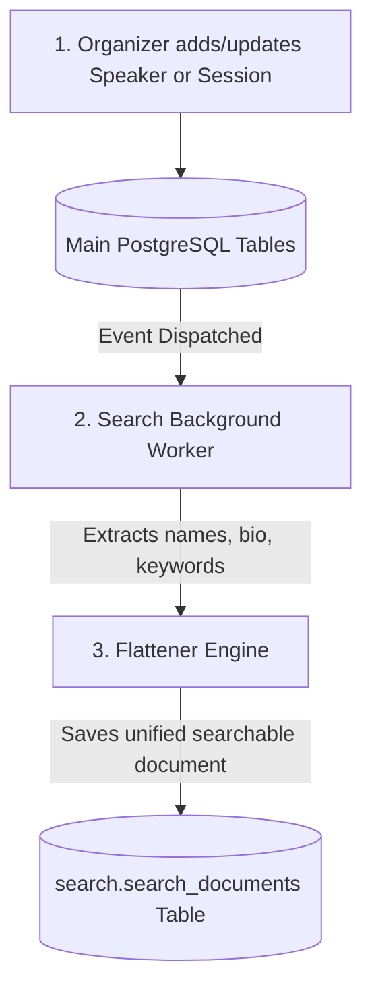
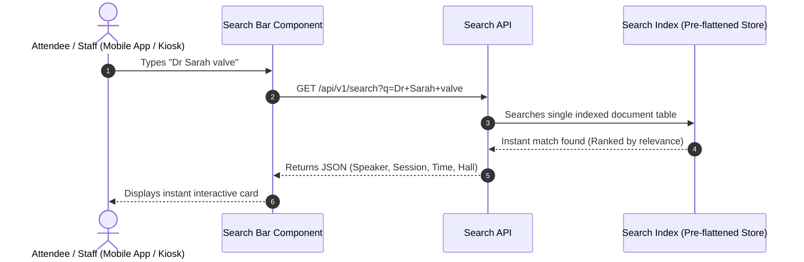
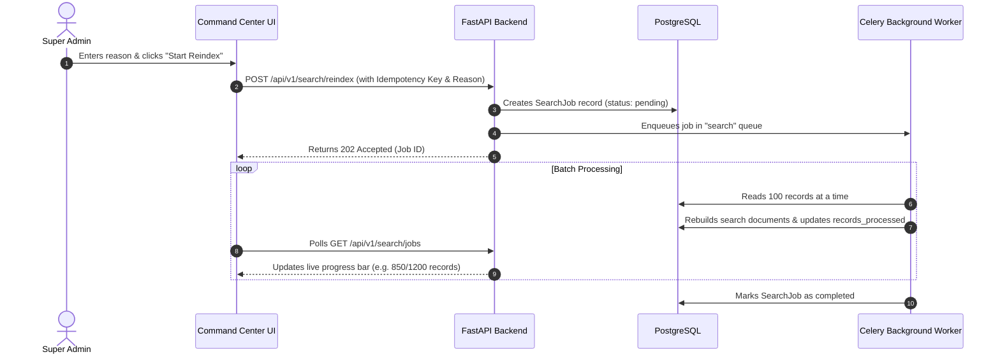

# Walkthrough: How Search Works in EVENTOS (Step-by-Step Flow)

## 1. The Core Idea: The "Book Index" Analogy

To understand how search works, think of a massive 1,000-page textbook:
* **Without a Search Index (Direct DB Query)**: Every time someone asks "Where is the topic *Cardiology*?", the computer has to flip through all 1,000 pages line by line. If 500 people ask at the same time, the computer gets exhausted and freezes.
* **With a Search Index (EVENTOS Search)**: The computer maintains a cheat sheet at the back of the book (*Index Page*). Next to "Cardiology", it already has the exact page numbers, speaker names, and hall locations. It answers in 0.01 seconds.

---

## 2. Flow 1: How Data Gets Indexed (The Preparation Flow)

When someone adds or edits information in EVENTOS (e.g. uploading a speaker profile or adding a session):

### Step-by-Step:
1. **Data Entry**: An organizer uploads an Excel sheet with 300 speakers, or a speaker edits their bio in the Speaker Portal.
2. **Background Notification**: The main database saves the record and notifies the background worker ([`services/workers/tasks/search_tasks.py`](file:///d:/DEV/conf-platform/services/workers/tasks/search_tasks.py)).
3. **Text Extraction**: The worker extracts all human-readable words:
   - Speaker name: *"Dr. Sarah Jenkins"*
   - Bio/Specialty: *"Pediatric Heart Surgeon, AI in Cardiology"*
   - Session: *"Innovations in Valve Replacement"*
   - Room: *"Grand Ballroom Hall C"*
4. **Flattening into Search Index**: The worker packages all these words into a single pre-indexed search record (`SearchDocument`).

---

## 3. Flow 2: When a User Searches (The Live Query Flow)

When an attendee, speaker, or staff member types in the search bar:

### Step-by-Step:
1. **Typing**: The user types any combination of words (e.g., doctor name + topic or room name).
2. **Single-Table Query**: The backend queries only the optimized `search.search_documents` table—no complex joins, no locking of main business tables.
3. **Instant Card Display**: In under 10 milliseconds, the UI displays rich cards (session timing, hall directions, speaker bio, downloadable slides).

---

## 4. Flow 3: Command Center Maintenance (The Full Reindex Flow)

When an administrator clicks **"Start Reindex"** in the Command Center ([`/operations-center/search`](file:///d:/DEV/conf-platform/apps/cloud/command-center/features/operations/routes/operations-center/search/PageScreen.tsx)):

### Why is this flow isolated?
* Because full reindexing processes thousands of records, it runs **completely in the background** on dedicated worker processes. The live conference app and attendees experience **zero slowdowns or interruptions**.
