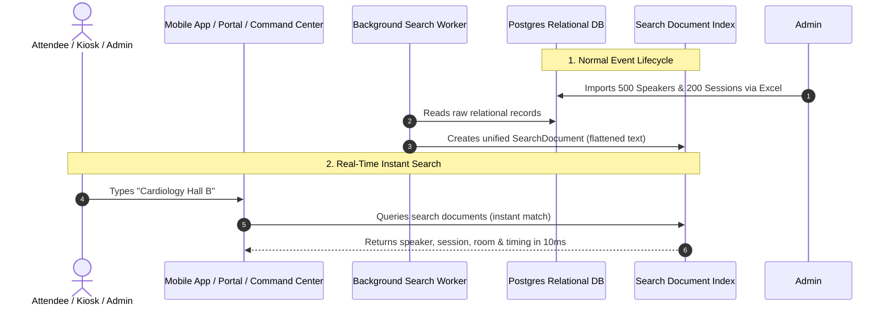

# Walkthrough: The Role and Importance of Search in EVENTOS

## 1. Executive Summary
In simple terms, **Search** is the "Google for your Conference". 

Instead of forcing users to click through 50 menus or query 10 different database tables to find a session, speaker, or paper, the Search Engine indexes all data into a lightning-fast lookup store.

---

## 2. Why is Search Critical for EVENTOS?

### A. The User Experience Problem:
During a 3-day medical conference with:
* 5,000 Attendees
* 300 Speakers & Faculty
* 40 Parallel Session Halls
* 1,200 Research Paper Abstracts & E-Posters

If an attendee is looking for *"Dr. Sharma's talk on Cardiology in Hall B"*, or a registration desk staff member is searching for *"John Doe from Oxford University"*:
* Querying multiple relational tables with complex `JOIN`s and `LIKE '%cardiology%'` takes seconds and overloads PostgreSQL.
* The specialized **Search Index** flattens all this information and returns the exact match in **under 10 milliseconds**.

### B. What Entities Are Searchable?
1. **Sessions & Agenda**: Titles, track names, room names, scheduled times, descriptions.
2. **Speakers & Authors**: Names, bios, affiliations, co-authors, medical/scientific specialties.
3. **Abstracts & Research Papers**: Scientific keywords, publication summaries, DOI references, e-poster numbers.
4. **Participants & Attendees**: Badges, ticket types, organization names.

---

## 3. How Does It Work Behind the Scenes?

---

## 4. Why Do We Need "Search Index Operations" in the Command Center?

In the Operations Console ([`/operations-center/search`](file:///d:/DEV/conf-platform/apps/cloud/command-center/features/operations/routes/operations-center/search/PageScreen.tsx)), platform admins have a tool to **Reindex**:
* **Why?** If an organizer bulk-imports 10,000 registrations via Excel, or if a database migration updates hundreds of abstracts, the search index needs to sync.
* **Governed Control**: Reindexing is resource-intensive, so the Command Center requires:
  1. Administrative reason ($\ge 12$ chars) to prevent accidental spamming.
  2. Background queuing (so the app never freezes or crashes).
  3. Progress tracking (`records_processed`, `status`, `duration`).
