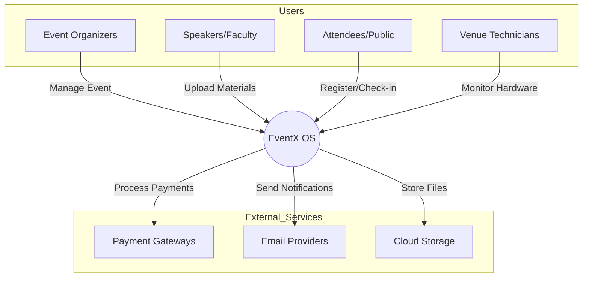
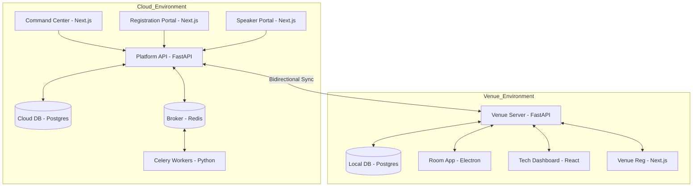

# EventX OS Master Architecture

This document provides a high-level architectural overview of the **EventX OS**, an enterprise-grade hybrid cloud/edge operating system for large-scale conferences and scientific events.

---

## 1. Executive Summary

EventX OS is designed to manage the end-to-end lifecycle of professional conferences, from public registration and speaker abstract management to on-site session execution. 

The platform's core innovation is its **Hybrid Cloud/Edge Model**:
- **Cloud Layer**: Centralizes global state, multi-tenant administration, high-volume processing, and public-facing portals.
- **Edge Layer**: Deploys localized "Venue Servers" on-site to provide offline resilience, zero-latency presentation playback, and local hardware integration (Badge Printing/IoT).

---

## 2. C4 Level 1: System Context

The following diagram illustrates how different user personas and external systems interact with the EventX OS ecosystem.

---

## 3. C4 Level 2: Container View

A deeper look into the internal applications (containers) that make up the Cloud and Venue environments.

---

## 4. Architectural Domains

### A. Multi-Tenant Model
EventX OS uses **Logical Multi-Tenancy**. Each "Organization" is a root tenant.
- **Data Isolation**: Enforced via PostgreSQL **Row-Level Security (RLS)** using an `organization_id` session variable.
- **RBAC**: A hierarchical Role-Based Access Control system allows permissions to be scoped at the Organization, Event, or even Room/Node level.

### B. Speaker & File Workflow
A specialized pipeline for scientific content:
1.  **Portal**: Speakers upload via the Speaker Portal using single-use tokens.
2.  **Processing**: Celery workers perform malware scanning, PPTX technical validation, and PDF/Thumbnail generation.
3.  **Approval**: Organizers review files in the Command Center.
4.  **Sync**: Approved files are pushed to the local Venue Server before the session starts.

### C. Registration & Attendee Lifecycle
1.  **Public**: Attendees register and pay via the Registration Portal (Stripe/Razorpay integration).
2.  **Badge**: System generates high-resolution badges based on custom templates.
3.  **On-site**: Attendee rosters are synced to the Venue Server for local QR check-in and badge printing, even without internet.

---

## 5. Trust Boundaries & Security

| Boundary | Protection Mechanism |
| :--- | :--- |
| **Cloud Admin** | JWT + RBAC (Hierarchical). |
| **Cloud Public** | Rate Limiting + CSRF + Scoped Tokens (OTP/Upload). |
| **Internal Sync** | Rotating machine-to-machine secrets (`X-Internal-Secret`). |
| **Venue Local** | Local Device Keys + Scoped Event IDs. |
| **Data-at-Rest** | AES-256 (Fernet) encryption for third-party API keys in the DB. |

---

## 6. Major Data Flows

### Real-time Event Stream
The platform utilizes **Socket.io** for real-time signaling.
- **Use Case**: When an attendee checks in at a physical kiosk, the Venue Server notifies the Cloud API, which then broadcasts a "Check-in" event to the Command Center dashboard in the cloud.

### Edge-Cloud Synchronization
- **Outbox Pattern**: Local changes at the venue are queued in a `SyncOutbox` and "drained" to the cloud as network conditions allow.
- **Conflict Resolution**: The Cloud is the primary source of truth for configuration; the Venue is the source of truth for on-site activity logs.

---

## 7. Technology Stack Summary

- **Frontend**: Next.js 16 (App Router), React 19, Tailwind CSS, Lucide React, Framer Motion.
- **Backend**: FastAPI (Python 3.12+), SQLAlchemy 2.0, Pydantic v2.
- **Desktop**: Electron (for hardware-dependent venue apps).
- **Asynchronous**: Celery + Redis.
- **Database**: PostgreSQL (Cloud) / PostgreSQL or SQLite (Edge).
- **Storage**: Cloudflare R2 / AWS S3 / Local MinIO.
- **Infrastructure**: Docker, Nginx, Kubernetes (Planned).

## Recent Changes (Refactor)
This document has been updated to reflect the SaaS transformation refactor completed on 2026-06-09.
Key changes include:
- Migration of legacy schemas to domain-driven namespaces (identity, illing, crm, etc.).
- Implementation of mandatory tenant lineage (organization_id/event_id).
- Introduction of soft delete framework (deleted_at, deleted_by).
- Standardization of Primary Keys to UUIDs for critical entities.
- Enhanced security with field-level encryption for TOTP and Stripe secrets.
