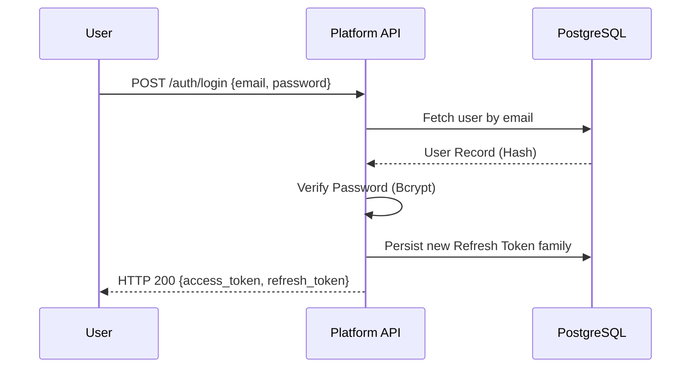

# EventX OS Authentication & Authorization Architecture

This document describes the security architecture of the EventX OS, covering identity management, session handling, and access control.

---

## 1. Authentication Lifecycle

### Login Flow
EventX OS uses a dual-token system for authentication:
1.  **Access Token**: A short-lived (default 30m) JWT containing user identity and basic claims.
2.  **Refresh Token**: A long-lived (default 7d) opaque cryptographically secure string stored in the database as a SHA-256 hash.

### Token Rotation & Security
To prevent session hijacking, EventX implements **Refresh Token Rotation**:
- Every time a refresh token is used, it is revoked and a new one is issued.
- If a revoked refresh token is presented (indicating a potential theft), the **entire token family** is invalidated, forcing all devices in that session to log out.

---

## 2. JWT Structure & Claims
The JWT access tokens are signed using HMAC-SHA256 (`HS256`).

| Claim | Key | Description |
| :--- | :--- | :--- |
| Subject | `sub` | The User's UUID. |
| Role | `role` | The user's primary role (e.g., `organiser`). |
| Organization| `org` | The active Organization UUID (Tenant ID). |
| JWT ID | `jti` | Unique identifier for the token. |
| Type | `type` | Set to `access` to prevent refresh-as-access attacks. |

---

## 3. Authorization & RBAC

### Role Hierarchy
EventX uses a hierarchical Role-Based Access Control system. Roles are defined in a strictly ordered list where lower index implies higher privilege.

**Primary Hierarchy:**
`super_admin` > `organiser` > `admin` > `registration_manager` > ... > `viewer`

### Permission System
Beyond simple roles, the system supports granular permission checks:
- **`roles` Table**: Custom and system roles.
- **`permissions` Table**: Atomic actions (e.g., `SESSIONS_CREATE`, `USER_PROMOTE`).
- **`user_access_nodes`**: Scopes permissions to specific physical or logical nodes (e.g., a specific Room or Station).

### API Guards (FastAPI Dependencies)
Route protection is enforced via reusable dependencies:
- `ActiveUser`: Ensures valid JWT + active account.
- `require_roles(*roles)`: Explicit role check.
- `require_min_role(role)`: Hierarchy-aware check.
- `get_current_event`: Automatically verifies that the requested event belongs to the user's organization.

---

## 4. Multi-Tenancy & Tenant Context

EventX OS implements **Logical Tenant Isolation** through a combination of middleware and database-level session variables.

1.  **Context Binding**: `TenantContextMiddleware` extracts the `org_id` from the JWT and binds it to a `ContextVar` (`tenant_org_id`).
2.  **DB Isolation**: When `get_db` yields a session, it executes:
    `SET app.current_organization_id = '<org_id>'`
3.  **RLS Enforcement**: PostgreSQL Row-Level Security (RLS) policies use this session variable to filter rows automatically, ensuring one tenant cannot read another's data even if a query is missing a `WHERE` clause.

---

## 5. Specialized API Guards

The platform provides secondary authentication methods for non-organizer entities:

- **Speaker Upload Tokens**: Speakers receive a unique, time-limited token via email. This token is hashed in the DB and allows access only to their specific session materials without requiring a full user account.
- **Device API Keys**: On-site hardware (Kiosks, Room Displays) use `X-Device-Key` headers. These keys are linked to a specific `room_device` and event, allowing the server to track device health and telemetry.

---

## 6. Security Middleware
- **AuthMiddleware**: Injects token state into `request.state` for early-stage logging and attaches global security headers (`X-Frame-Options`, `X-Content-Type-Options`).
- **AuditLogMiddleware**: Captures all state-changing requests, linking them to the `user_id` and `ip_address` extracted from the auth state.
- **RateLimitMiddleware**: Protects sensitive endpoints (Login, Password Reset) from brute-force attacks.

---

## 7. Observed Weaknesses & Considerations

1.  **Hardcoded Role List**: The `ROLE_HIERARCHY` is defined as a static list in code, making it difficult to add new roles without a redeployment.
2.  **No MFA/2FA**: The current implementation does not show support for Multi-Factor Authentication.
3.  **Token Family Persistence**: Refresh token families are stored in the main DB. High-traffic rotation may lead to high write volume on the `refresh_tokens` table.
4.  **No OAuth2/OIDC**: Currently restricted to local email/password authentication; no native support for "Login with Google/Microsoft" found.
