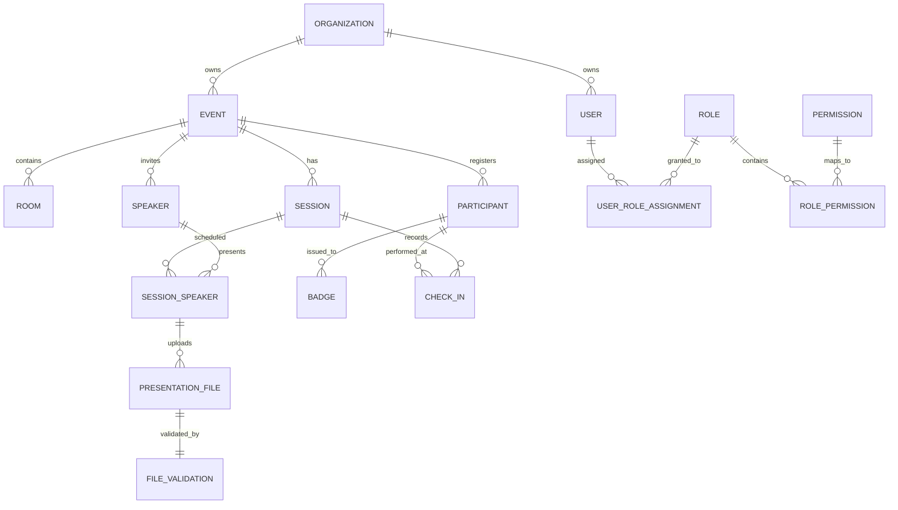

# EventX OS Database Architecture

This document details the database schema, relationships, and multi-tenancy patterns of the EventX OS ecosystem.

---

## 1. Database Inventory

The EventX OS database is segregated into logical schemas to ensure domain isolation and security.

### Logical Schemas
- **`auth`**: Identity management, user credentials, and session tokens.
- **`rbac`**: Multi-tenant organization structure, events, and role-based permissions.
- **`speakers`**: Speaker management, sessions, and speaker profiles.
- **`presentations`**: File versioning, validation results, and display queues.
- **`registration`**: Attendee data, participant roles, tickets, payments, and badge printing.
- **`notifications`**: Email templates, campaigns, logs, and webhooks.
- **`venue`**: On-site device management, telemetry, and local sync orchestration.

---

## 2. Table Inventory & Domain Analysis

### Domain: Auth & Identity (`auth` schema)
| Table | Purpose | Primary Key | Foreign Keys | Key Columns |
| :--- | :--- | :--- | :--- | :--- |
| `users` | Organizer/staff accounts | `id` (UUID) | `organization_id` | `email`, `password_hash`, `role`, `is_platform_admin` |
| `refresh_tokens` | JWT refresh persistence | `id` | `user_id` | `token_hash`, `expires_at`, `is_revoked` |
| `security_events` | Security auditing (logins, failures) | `id` | `user_id`, `event_id` | `event_type`, `risk_level`, `ip_address` |
| `system_error_logs` | Global application exception logs | `id` | - | `exception_type`, `stack_trace`, `environment_metadata` |

### Domain: Multi-Tenancy & RBAC (`rbac` schema)
| Table | Purpose | Primary Key | Foreign Keys | Key Columns |
| :--- | :--- | :--- | :--- | :--- |
| `organizations` | Root tenant (Customer) | `id` | - | `slug`, `plan`, `primary_color`, `is_active` |
| `events` | Conference instance | `id` | `organization_id` | `short_code`, `status`, `start_date`, `license_tier` |
| `roles` | Custom/System RBAC roles | `id` | `organization_id` | `name`, `is_system_role` |
| `permissions` | Atomic system actions | `id` | - | `code` (e.g., SESSIONS_CREATE), `module` |
| `role_permissions` | Role-Permission mapping | `id` | `role_id`, `permission_id` | - |
| `user_role_assignments`| User role grants | `id` | `user_id`, `role_id`, `organization_id`, `event_id` | - |

### Domain: Speakers & Agenda (`speakers` schema)
| Table | Purpose | Primary Key | Foreign Keys | Key Columns |
| :--- | :--- | :--- | :--- | :--- |
| `speakers` | Presenters (Auth via tokens) | `id` | `event_id`, `user_id` | `upload_token`, `speaker_code`, `upload_status` |
| `sessions` | Scheduled time blocks | `id` | `event_id`, `room_id` | `session_code`, `start_time`, `status` |
| `session_speakers` | Speaker-Session assignment | `id` | `session_id`, `speaker_id` | `talk_order`, `talk_duration_minutes` |
| `speaker_profiles` | Expanded speaker metadata | `id` | `speaker_id` | `bio`, `photo_url`, `social_links` |

### Domain: Presentations (`presentations` schema)
| Table | Purpose | Primary Key | Foreign Keys | Key Columns |
| :--- | :--- | :--- | :--- | :--- |
| `presentation_files` | File versions & storage refs | `id` | `speaker_id`, `session_speaker_id` | `storage_path`, `is_current_version`, `upload_status` |
| `file_validations` | Technical analysis of files | `id` | `file_id` | `overall_result`, `slide_count`, `has_missing_fonts` |
| `posters` | Digital ePoster submissions | `id` | `event_id`, `speaker_id` | `storage_path`, `status`, `display_screen` |
| `presentation_queue` | On-site screen playback order | `id` | `session_id`, `file_id` | `queue_order`, `status` |

---

## 3. Relationship Graph

---

## 4. Architectural Observations

### Multi-Tenancy Strategy
- **Logical Isolation**: Uses the `organization_id` as the root tenant discriminator across all major tables.
- **Row-Level Security (RLS)**: Schema migrations indicate the enablement of PostgreSQL RLS on tenant tables to prevent cross-organization data leakage.
- **Hierarchical Access**: Users can be assigned at the **Organization** level (Full access) or scoped to specific **Events** or even **Access Nodes** (Room/Station).

### Security Critical Tables
1.  **`auth.users`**: Contains sensitive password hashes and 2FA secrets.
2.  **`auth.refresh_tokens`**: If compromised, allows session hijacking.
3.  **`rbac.permissions` & `rbac.role_permissions`**: These define the entire authorization boundary of the system.
4.  **`speakers.speakers`**: The `upload_token` acts as a "passwordless" secret for speakers to upload files.
5.  **`registration.participants`**: Contains PII (Personal Identifiable Information) including emails and phone numbers.

### Logical Domains (Suggested)
1.  **Identity & Security**: `auth` schema components.
2.  **Organization & Authorization**: `rbac` schema components.
3.  **Scientific Content**: `speakers` and `presentations` schemas (Sessions, Files, Posters).
4.  **Attendee Lifecycle**: `registration` schema (Tickets, Badges, Check-ins).
5.  **Operations & IoT**: `venue` schema (Devices, Stations, Telemetry).
6.  **Engagement & Communications**: `notifications` schema (Campaigns, Webhooks).

---

## 5. Storage Patterns
- **Object Storage**: Large files (Presentations, Posters, Logos) are stored externally (S3/MinIO), with only the `storage_path` and `stored_filename` persisted in the DB.
- **Local Resilience**: The `local_cache_path` and `local_sync_status` in `presentation_files` indicate a robust edge-syncing mechanism for offline venue support.

## Recent Changes (Refactor)
This document has been updated to reflect the SaaS transformation refactor completed on 2026-06-09.
Key changes include:
- Migration of legacy schemas to domain-driven namespaces (identity, illing, crm, etc.).
- Implementation of mandatory tenant lineage (organization_id/event_id).
- Introduction of soft delete framework (deleted_at, deleted_by).
- Standardization of Primary Keys to UUIDs for critical entities.
- Enhanced security with field-level encryption for TOTP and Stripe secrets.
