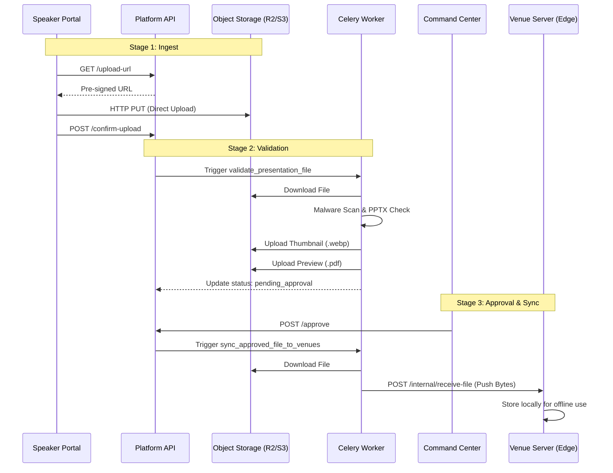

# EventX OS File Processing Pipeline

This document details the architecture, lifecycle, and synchronization mechanisms for all file uploads within the EventX OS ecosystem.

---

## 1. High-Level Pipeline Architecture

The EventX OS file pipeline is designed for high-volume ingest, rigorous technical validation, and resilient edge-synchronization.

---

## 2. Upload Lifecycles

### A. Speaker Presentations (Complex Pipeline)
- **Ingest**: Direct-to-cloud upload using pre-signed URLs to reduce API server load.
- **Validation**:
    - **Malware Scanning**: Passive analysis for macros and threats.
    - **Technical Validation**: PPTX structure check, missing font detection, video codec verification.
- **Processing**:
    - **Thumbnails**: Automated generation of WEBP thumbnails for organizer previews.
    - **PDF Preview**: LibreOffice-based conversion of PPTX to PDF for in-browser viewing in the Command Center.
- **Delivery**: Files are "pushed" from the cloud worker to on-site venue servers once approved.

### B. Registration Uploads (Direct Pipeline)
- **Ingest**: Direct bytes upload to the `registration_uploads` bucket.
- **Processing**: Minimal. Primarily used for participant photos, certificates, or ID proofs.
- **Security**: Access is restricted via pre-signed URLs with a 1-year expiry.

---

## 3. Storage Strategy

| Content Type | Bucket Name | Backend Storage | Access Pattern |
| :--- | :--- | :--- | :--- |
| Presentations | `presentations` | R2 / S3 | Pre-signed Upload/Download |
| Processing Output| `thumbnails` | R2 / S3 | Public (via CDN) / Pre-signed |
| Registration | `registration_uploads` | MinIO / S3 | Internal / Pre-signed |
| System Assets | `assets` | Local / S3 | Public |

---

## 4. Worker Tasks (Celery)

The following background tasks (located in `services/workers/tasks/file_tasks.py`) orchestrate the pipeline:

1.  **`validate_presentation_file`**: The entry point for all presentation processing. Performs file type specific validation (PPTX, PDF, MP4).
2.  **`generate_file_thumbnail`**: Uses `FFmpeg` or `Pillow` to extract the first slide/frame and generate a highly compressed WEBP thumbnail.
3.  **`convert_presentation_to_pdf`**: Utilizes a headless `LibreOffice` instance to convert proprietary formats into a portable PDF format for web-based reviewing.

---

## 5. Synchronization & Edge Resilience

To ensure 100% uptime during a live session, files are synchronized to the venue before the event begins:

- **Incremental Sync**: When an individual file is approved, the cloud worker immediately pushes it to the configured list of `venue_server_list` endpoints.
- **Full Sync**: The `sync_full_event_to_venue` task performs a bulk push of all approved materials, used for event activation or server replacement.
- **Snapshot Lock**: The `Venue Server` freezes the session state (Session ID + Approved File ID) to prevent unexpected updates while a session is live on stage.

---

## 6. Identified Services & Dependencies

- **API Service**: Manages DB records and issues pre-signed URLs.
- **Celery Workers**: Performs CPU-intensive validation and conversion.
- **Redis**: Acts as the message broker between the API and Workers.
- **R2 / S3**: Persistent cloud storage for all binary data.
- **FFmpeg**: Used for video frame extraction and metadata.
- **LibreOffice**: Used for high-fidelity PPTX to PDF conversion.
- **Venue Server**: Local FastAPI instance receiving file pushes via `/internal/receive-file`.
