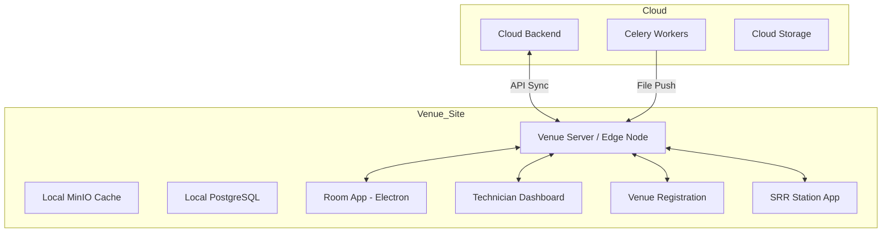
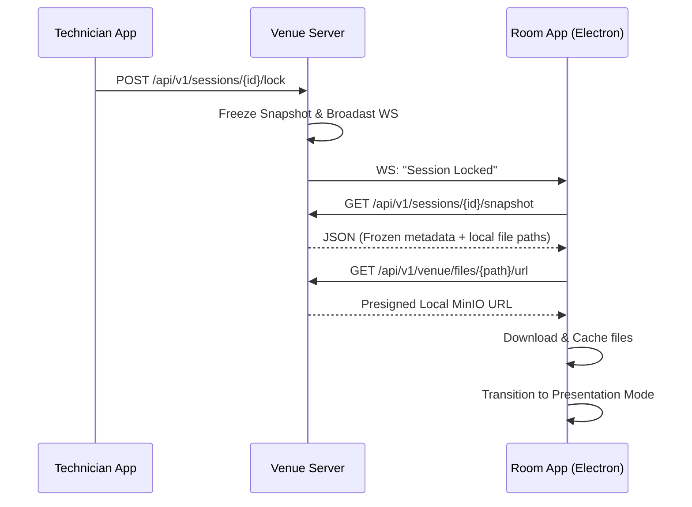

# EventX OS Venue Architecture

This document describes the on-site architecture of EventX OS, focusing on the interactions between the Cloud Backend, the Venue Server (Edge Node), and specialized local applications.

---

## 1. High-Level Venue Architecture

EventX OS employs an **Edge-First** architecture. While the system manages global configuration in the cloud, all critical show-day operations (presentations, check-ins, printing) are handled by a local Venue Server to ensure 100% availability regardless of internet status.

---

## 2. Synchronization Mechanisms

### A. Cloud-to-Edge Push (Presentation Files)
When a file is approved in the Command Center, the cloud worker immediately pushes the binary bytes to the Venue Server's `/internal/sync/receive-file` endpoint. The Venue Server saves these files to a local MinIO bucket for instant playback.

### B. Cloud-to-Edge Pull (Schedule & Metadata)
The Venue Server runs a periodic background task (`schedule_pull.py`) that fetches the latest event metadata, session details, and participant lists.
- **Webhook Trigger**: The Cloud Backend sends a `queue-updated` webhook to the Venue Server whenever an organizer reorders a session, triggering an immediate sync.

### C. Edge-to-Cloud Sync (Audit & Attendance)
All local activities (check-ins, badge scans, print logs) are first written to a local `SyncOutbox` table. A background processor (`outbox_processor.py`) attempts to "drain" this outbox by POSTing the logs to the Cloud Backend whenever an internet connection is available.

---

## 3. Specialized Local Services

### The Snapshot API
Designed specifically for the **Room App**, the Snapshot API provides a "frozen" execution state for a session. It includes:
- Metadata for all speakers in the session.
- Local storage paths for their presentation files.
- The exact order of play.
The Room App pre-loads this JSON to its local disk to survive even a Venue Server restart.

### Device Registry & Heartbeats
The Venue Server maintains an in-memory `registry` of all connected devices (Kiosks, Room PCs). 
- **Technician Visibility**: IT staff use the **Technician Dashboard** to monitor which projectors are online and the battery/connection status of scanners.
- **Remote Control**: Technicians can remotely "Lock" a session room or change a scanner's mode (e.g., from "General Entry" to "VIP Workshop") via the Local API.

---

## 4. Offline Resilience (Show-Day Continuity)

The system is designed to handle three failure scenarios:

| Failure | Behavior |
| :--- | :--- |
| **Internet Outage** | Venue Server continues providing local Snapshot, Printing, and Attendance APIs. All logs are queued in the `SyncOutbox` for later upload. |
| **Cloud Backend Down** | Identical to an internet outage. The local venue is a fully functional independent cell. |
| **Local Server Failure** | Room Apps and Kiosks use the last-downloaded `snapshot.json` and cached files from their local disk. Scanners queue logs in memory until the Venue Server is restored. |

---

## 5. Interaction Sequence: Session Start

---

## 6. Security at the Edge
- **Device API Keys**: All local applications must provide an `X-Device-Key` (hashed on-server) to access Local APIs.
- **Sync Secrets**: Communication between Cloud and Venue is protected by a long-lived `X-Internal-Secret` to prevent spoofed data pushes.
- **Tenant Scoping**: The Venue Server is scoped to a single `event_id`, ensuring on-site staff cannot inadvertently access data from other conferences.
