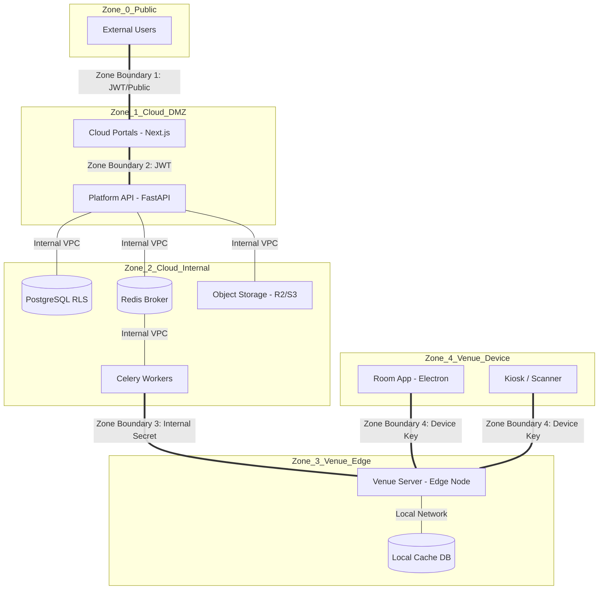

# EventX OS Trust Boundaries

This document provides a formal trust boundary analysis and security architecture mapping for the EventX OS ecosystem. It identifies logical and physical boundaries where data transitions between different levels of trust.

---

## 1. Trust Zone Definitions

The ecosystem is divided into five distinct trust zones:

1.  **Zone 0: Public Internet (Untrusted)** — External users, bot traffic, and unauthenticated requests.
2.  **Zone 1: Cloud DMZ (Semi-Trusted)** — Public-facing Next.js portals and the primary API ingress.
3.  **Zone 2: Cloud Internal (Trusted)** — Private VPC containing the primary database, Redis broker, and Celery workers.
4.  **Zone 3: Venue Edge (Semi-Trusted)** — On-site Venue Server. Operates in a local area network (LAN) but is physically accessible.
5.  **Zone 4: Venue Device (Trusted)** — Room display PCs and Kiosks running Electron/Next.js with local persistent storage.

---

## 2. Trust Boundary Diagram

---

## 3. Communication Channel Inventory

| Source | Destination | Auth Mechanism | Encryption | Data Sensitivity | Trust Boundary Crossed |
| :--- | :--- | :--- | :--- | :--- | :--- |
| Browser | Cloud Portals | None (Static) | HTTPS (TLS) | Low (Public UI) | Zone 0 → Zone 1 |
| Cloud Portal | Platform API | **JWT (Bearer)** | HTTPS (TLS) | High (PII/Auth) | Zone 1 → Zone 1 |
| Platform API | PostgreSQL | Native Creds | TLS (Internal) | Highest (All Data) | Zone 1 → Zone 2 |
| Platform API | Redis | Native Creds | Plaintext/TLS | Medium (Tasks) | Zone 1 → Zone 2 |
| Platform API | S3 / R2 | **Signed URLs** | HTTPS (TLS) | High (Binary) | Zone 1 → External |
| Celery Worker | Venue Server | **Internal API Key**| HTTPS (TLS) | High (Sync Data) | Zone 2 → Zone 3 |
| Venue Server | Local DB | Native Creds | Plaintext (Unix)| High (Local PII) | Zone 3 → Zone 3 |
| Room App | Venue Server | **Device Key** | HTTP/HTTPS | Medium (Metadata) | Zone 4 → Zone 3 |
| Scanner App | Venue Server | **Device Key** | HTTP/HTTPS | High (Attendee) | Zone 4 → Zone 3 |
| Payment GW | Platform API | **HMAC Signature** | HTTPS (TLS) | Highest (Finance) | External → Zone 1 |

---

## 4. Security Pattern Mapping

Based on the repository analysis, the following security patterns are mandatory for each channel:

### JSON Web Tokens (JWT)
- **Used for**: All Portal-to-API communications.
- **Pattern**: Short-lived access tokens with `sub` and `org` claims.
- **Enforcement**: `AuthMiddleware.py` and FastAPI `ActiveUser` dependency.

### API Keys / Internal Secrets
- **Used for**: Cloud-to-Edge sync and service-to-service tasks.
- **Pattern**: High-entropy strings (`X-Internal-API-Key`) rotated per environment.
- **Enforcement**: `verify_cloud` header dependency in `cloud_sync.py`.

### Signed URLs (S3 v4)
- **Used for**: Direct browser uploads and downloads.
- **Pattern**: Time-limited (1h) pre-signed paths generated by `upload_service.py`.
- **Enforcement**: AWS/R2 SDK signature generation.

### HMAC Signatures
- **Used for**: Third-party webhooks (Razorpay/Stripe).
- **Pattern**: SHA-256 hash calculation using a shared secret.
- **Enforcement**: `payment_service.py` verification logic.

### Device API Keys
- **Used for**: On-site hardware identification.
- **Pattern**: Unique `X-Device-Key` mapped to a specific `room_device` in the database.
- **Enforcement**: `DeviceAuth` dependency in `local_api.py`.

---

## 5. Architectural Security Observations

1.  **Row-Level Security (RLS)**: The most critical trust boundary is within the PostgreSQL database itself. RLS acts as a secondary enforcement layer to prevent "Vertical Privilege Escalation" between tenants even if the API code has a bug.
2.  **Edge Isolation**: The Venue Server is scoped to a single `event_id`. This creates a hard trust boundary; even a total compromise of a Venue Server does not grant access to the global Cloud database or other active events.
3.  **Token Rotation**: The use of Refresh Token Families (documented in `AUTH_ARCHITECTURE.md`) mitigates the risk of Zone 0 session theft.
4.  **Credential Encryption**: Sensitive Zone 2 secrets (Payment Keys) are stored with AES-256 (Fernet) encryption, ensuring that a read-only database compromise does not immediately expose third-party gateways.
