# EventX OS User Journeys

This document provides sequence diagrams for the primary user journeys and business processes within the EventX OS ecosystem.

---

## 1. Organization Onboarding
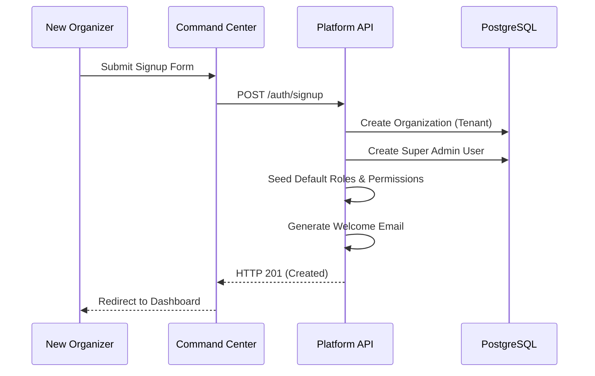

## 2. Event Creation
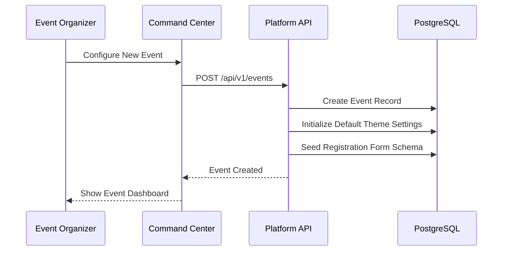

## 3. Speaker Invitation
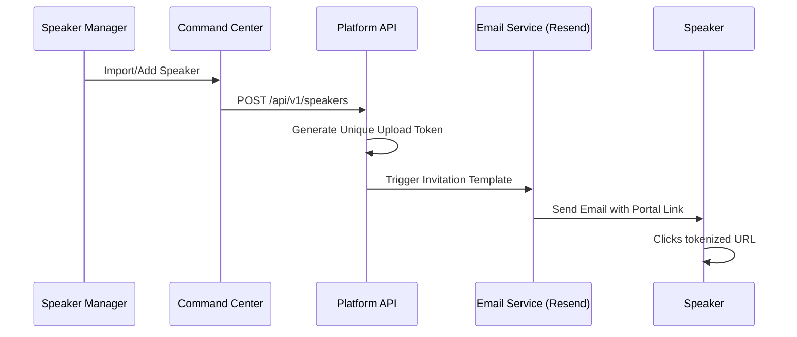

## 4. Speaker Upload (Direct-to-Cloud)
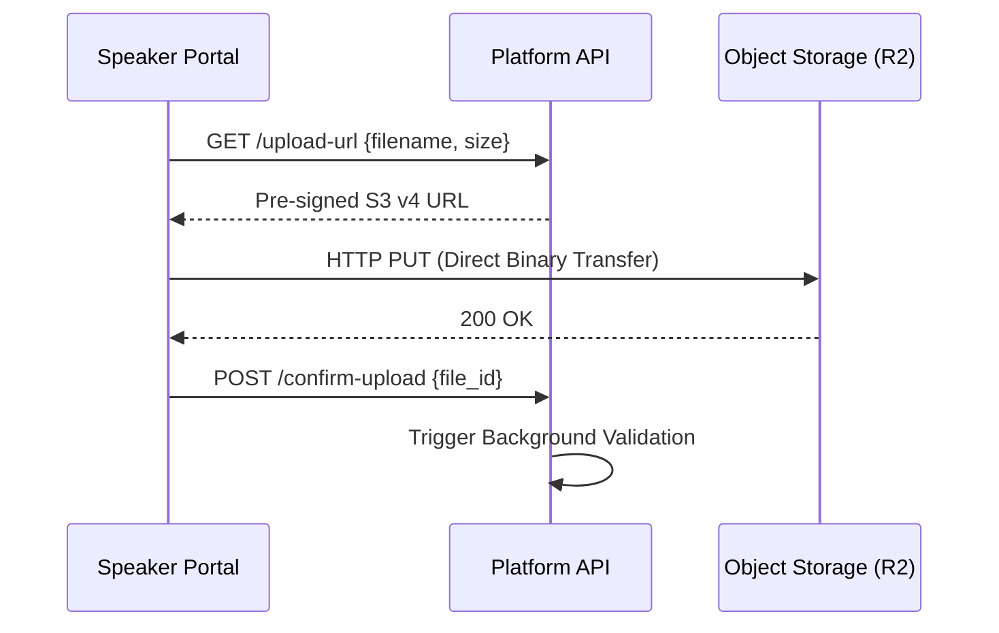

## 5. SRR Validation (Scientific Review)
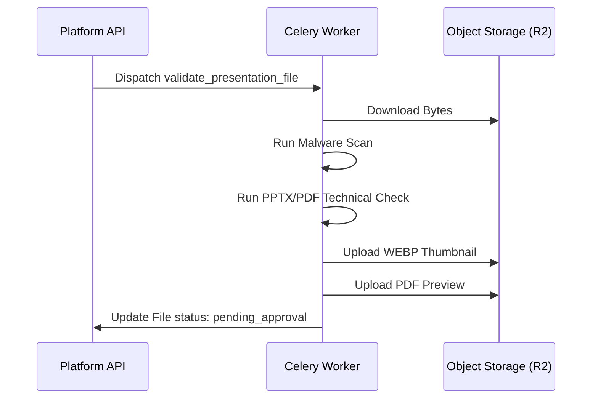

## 6. Venue Synchronization (Edge Sync)
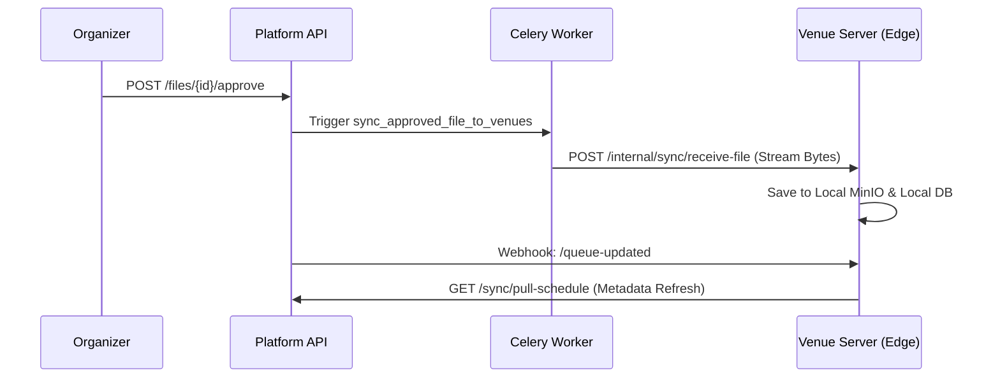

## 7. Room Playback (Live Session)
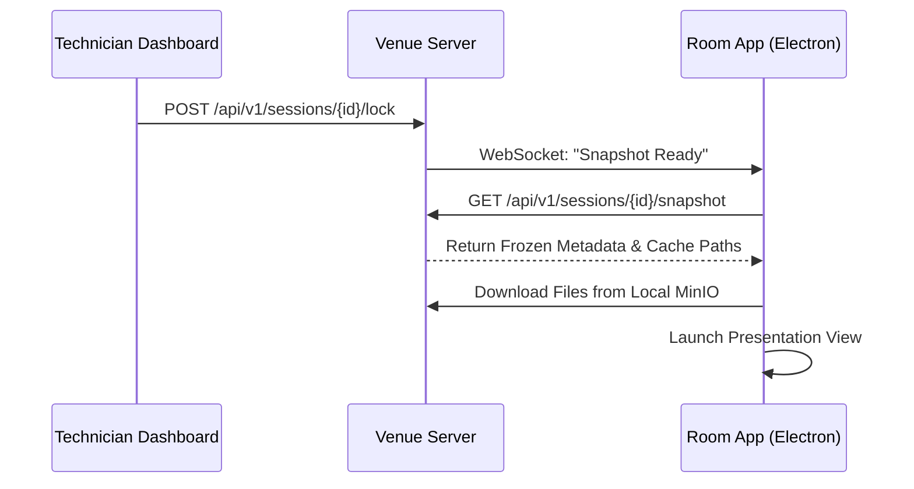

## 8. Participant Registration
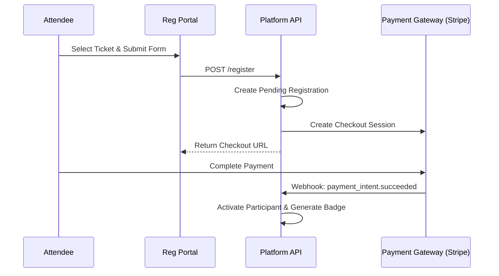

## 9. Badge Printing
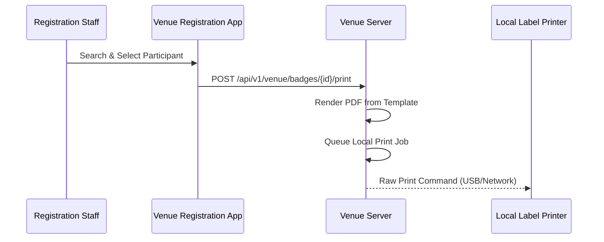

## 10. Check-in (Offline Capable)
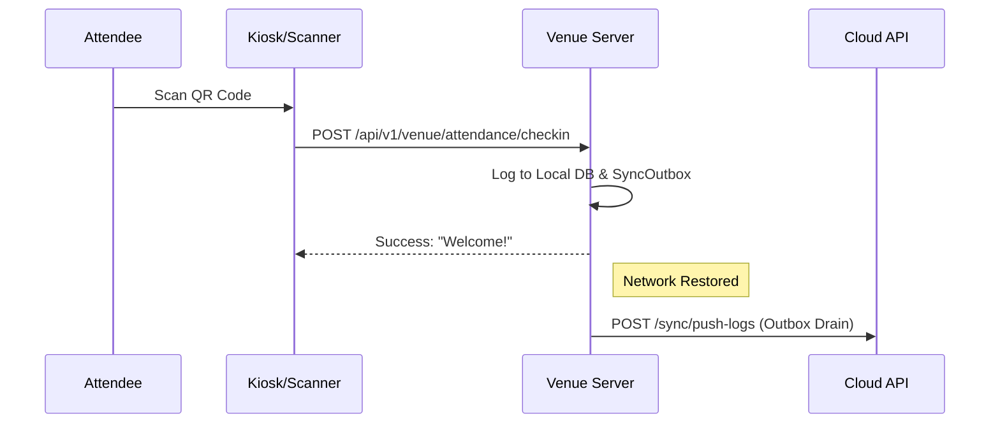

## 11. ePoster Publication
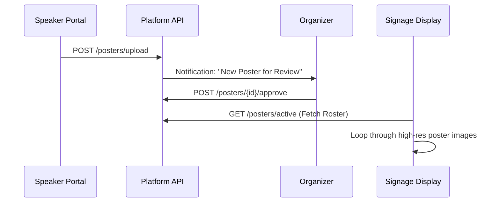
