# Walkthrough - Tamper-Evident Audit Logging

We have successfully implemented and verified the enterprise-grade, tamper-evident audit logging system for the multi-tenant conference SaaS (CPMS) backend.

## Architectural Overview

The audit logging system intercepts all state-mutating requests (POST, PUT, PATCH, DELETE) at the ASGI layer, logs them asynchronously via Celery background tasks to postgres, and signs them cryptographically using a deterministic SHA-256 hashing listener to ensure data integrity (tamper-detection). 

```mermaid
sequenceDiagram
    autonumber
    actor Client
    participant Middleware as ASGI Audit Middleware
    participant Router as API Router
    participant DB as Postgres Database
    participant Celery as Celery Broker & Task
    
    Client->>Middleware: Mutating Request (e.g., PUT /events/{id})
    activate Middleware
    Middleware->>DB: Fetch BEFORE State Snapshot (Pre-request query)
    Middleware->>Router: Delegate down request pipeline
    activate Router
    Router->>DB: Write Mutation to DB
    Router-->>Middleware: Response with AFTER State (2xx JSON)
    deactivate Router
    
    rect rgb(20, 20, 30)
        Note over Middleware, Celery: Async Offloading
        Middleware->>Middleware: Compute Recursive JSON Patch (Diff)
        Middleware->>Middleware: Evaluate is_sensitive & retention_until (2 vs 7 years)
        Middleware->>Celery: Dispatch write_audit_log task
    end
    
    Middleware-->>Client: Return Response
    deactivate Middleware
    
    activate Celery
    Celery->>DB: Write Audit Log Row
    Note over DB: SQLAlchemy before_insert listener signs row<br/>with SHA-256 row_hash
    deactivate Celery
```



---

## Changes Made

### 1. Database & Migrations
- **Created Migration**: `services/backend/alembic/versions/20260610_2020_4018c218c647_audit_tamper_detection.py`
  - Normalized `audit.logs` schema to exactly 20 columns.
  - Renamed `acting_user_id` -> `actor_user_id`, `ip_address` -> `actor_ip` (converted to `VARCHAR(45)`), `user_agent` -> `actor_user_agent`, `action` -> `action_type`, `entity_type` -> `resource_type`, `entity_id` -> `resource_id`, `old_values` -> `old_state`, `new_values` -> `new_state`.
  - Added columns `diff` (JSONB), `actor_role` (VARCHAR(50)), `impersonated_by` (UUID), and `is_sensitive` (Boolean).
  - Dropped legacy/unused columns: `event_id`, `user_id`, `target_user_id`, `severity`.
- **Created Table `audit.worker_logs`**:
  - Implemented the `WorkerJobLog` model to track Celery task execution failures and fallback records, keeping the main audit pipeline fault-tolerant.

### 2. SQLAlchemy Models
- **Modified [audit_log.py](file:///d:/DEV/conf-platform/services/backend/app/modules/audit/models/audit_log.py)**:
  - Updated `AuditLog` mapping to match the 20-column layout exactly.
  - Registered a SQLAlchemy `before_insert` event listener `generate_row_hash` that computes the cryptographic SHA-256 `row_hash` of:
    `f"{action_type}:{resource_id}:{actor_user_id}:{occurred_at}:{new_state}"`
- **Created [api_request_log.py](file:///d:/DEV/conf-platform/services/backend/app/modules/audit/models/api_request_log.py)**:
  - Created SQLAlchemy model `WorkerJobLog` to persist worker failures.

### 3. Audit Services & Celery Tasks
- **Created [audit_service.py](file:///d:/DEV/conf-platform/services/backend/app/modules/audit/services/audit_service.py)**:
  - Implemented the `AuditContext` schema wrapper.
  - Implemented `AuditService.write_log(ctx)` to route audit writes to Celery asynchronously.
  - Implemented `AuditService.write_log_sync(ctx)` for critical synchronous writes.
- **Created [audit_tasks.py](file:///d:/DEV/conf-platform/services/backend/app/tasks/audit_tasks.py)**:
  - Implemented the Celery task `write_audit_log` with retry-on-failure decorators, utilizing a separate thread-isolated engine to avoid connection leaks.
  - If retry limits are exhausted, it intercepts exceptions and persists failure context into the `audit.worker_logs` failover table.
- **Modified [__init__.py](file:///d:/DEV/conf-platform/services/backend/app/tasks/__init__.py)**:
  - Registered the Celery tasks so they are discovered by the Celery app worker automatically.

### 4. ASGI Middleware Interceptors
- **Created [audit_middleware.py](file:///d:/DEV/conf-platform/services/backend/app/middleware/audit_middleware.py)**:
  - Captures BEFORE state snapshot for mutations (PUT, PATCH, DELETE) by sniffing paths containing resource IDs and running a quick pre-request query.
  - Snippets responses to extract the AFTER state.
  - Calculates JSON patch diffs recursively using `make_json_diff`.
  - Determines data sensitivity (is_sensitive=True if targeting `identity.*`, `rbac.*`, or `billing.*`) and assigns legal retention schedules (7 years for financial/billing resources, 2 years otherwise).
- **Modified [main.py](file:///d:/DEV/conf-platform/services/backend/app/main.py)**:
  - Replaced `AuditLogMiddleware` with the new `AuditMiddleware`.

### 5. API Endpoints
- **Modified [router.py](file:///d:/DEV/conf-platform/services/backend/app/modules/platform/router.py)**:
  - Implemented `GET /platform/audit` for Super Admins.
  - Supports comprehensive filters: `action_type`, `resource_type`, `actor_user_id`, `organization_id`, `date_from`, `date_to`, and `is_sensitive`.
  - Implemented cursor-based pagination using a base64-encoded `occurred_at` + `id` cursor.
  - Restricts access to `old_state` and `new_state` unless `include_state=true` query param is explicitly supplied.
- **Modified [audit.py](file:///d:/DEV/conf-platform/services/backend/app/modules/audit/routers/audit.py)**:
  - Implemented `GET /audit/my-activity` for Organizers.
  - Limits returned logs to `current_user.id` and caps duration to the last 90 days.
  - Completely excludes data snapshots (`old_state` and `new_state`) for security.

### 6. Model/Middleware Adjustments
- **Modified [events.py](file:///d:/DEV/conf-platform/services/backend/app/modules/rbac/routers/events.py)**:
  - Changed nuclear wipe query to filter on `AuditLog.resource_id` instead of the dropped `event_id` column.
- **Modified [user.py](file:///d:/DEV/conf-platform/services/backend/app/modules/identity/models/user.py)**:
  - Fixed relationship mapping between `User` and `AuditLog` to point to `actor_user_id`.
- **Modified [rbac_middleware.py](file:///d:/DEV/conf-platform/services/backend/app/middleware/rbac_middleware.py)**:
  - Changed RBAC failure logs to match the 20-column model schema.
- **Modified [auth_service.py](file:///d:/DEV/conf-platform/services/backend/app/modules/identity/services/auth_service.py)**:
  - Aligned credential and login failure audit logging with the new schema.

---

## Verification Results

A comprehensive suite of unit and integration tests has been executed in `tests/test_audit_system.py`, validating:
1. `test_row_hash_generation`: Validates the deterministic integrity hashes of rows.
2. `test_make_json_diff`: Confirms correct JSON Patch (RFC 6902) outputs for deep structures.
3. `test_audit_middleware_captures_post`: Verifies ASGI middleware intercepts POST requests and resolves resource IDs.
4. `test_audit_middleware_captures_put`: Verifies middleware fetches pre-request snapshots and generates diffs.
5. `test_platform_audit_cursor_pagination`: Validates cursor parsing, state masking, and filtering on `GET /platform/audit`.
6. `test_organizer_my_activity_timeline`: Confirms timeline restrictions to the actor's past 90 days on `GET /audit/my-activity`.
7. `test_celery_task_and_worker_logging`: Simulates transient worker errors and validates failover persistence to `WorkerJobLog`.

### Pytest Log Summary

All 7 test cases passed cleanly with zero failures:

```bash
============================= test session starts =============================
platform win32 -- Python 3.13.6, pytest-9.0.3, pluggy-1.6.0
rootdir: D:\DEV\conf-platform\services\backend
configfile: pytest.ini
plugins: anyio-4.6.2, Faker-40.21.0, asyncio-1.4.0, cov-7.1.0, mock-3.15.1
asyncio: mode=Mode.AUTO, debug=False, asyncio_default_fixture_loop_scope=None, asyncio_default_test_loop_scope=function
collected 7 items

tests\test_audit_system.py .......                                       [100%]

======================= 7 passed, 9 warnings in 13.55s ========================
```
