# Walkthrough - Rate Limiting & Feature Gating

We have successfully implemented and verified the production-grade, multi-tenant rate limiting and feature gating system for the conference SaaS (CPMS) backend.

## Architectural Overview

The solution consists of three major components:
1. **Dynamic Feature Gating**: A decorator-based dependency check (`@require_feature`) that verifies tenant entitlements, bypasses check for Super Admins, and returns a structured custom response upon failure.
2. **Sliding Window Rate Limiter**: An ASGI middleware (`RateLimiterMiddleware`) that applies per-organization sliding window rate limiting using Redis ZSETs (minute and daily windows), supports database organization-level overrides, injects rate-limiting response headers, and bypasses health paths and Super Admins.
3. **API Usage Analytics Buffer**: An async background pipeline that buffers API usage counters in Redis using atomic operations and flushes them to the PostgreSQL `analytics.api_usage` table via a Celery beat scheduler.

```mermaid
sequenceDiagram
    autonumber
    actor Client
    participant Middleware as ASGI Rate Limiter Middleware
    participant Router as API Router / Feature Gate
    participant DB as Postgres Database
    participant Redis as Redis Cache / ZSET
    participant Celery as Celery worker
    
    Client->>Middleware: API Request
    activate Middleware
    Middleware->>Redis: Check limits cached?
    alt Not Cached
        Middleware->>DB: Query tenant plan & rate limits (tenant filter bypassed)
        Middleware->>Redis: Cache limits (setex)
    end
    
    Middleware->>Redis: Evaluate ZSET sliding windows (rl:{org_id}:minute & rl:{org_id}:day)
    alt Limit Exceeded
        Middleware-->>Client: HTTP 429 Too Many Requests (Retry-After headers)
    else Under Limit
        Middleware->>Router: Delegate down request pipeline
        activate Router
        
        rect rgb(20, 30, 20)
            Note over Router: Feature Gate Check
            Router->>DB: Verify Entitlements (EntitlementService.has_feature)
            alt Missing Entitlement
                Router-->>Client: HTTP 403 Forbidden (ERR_ENTITLEMENT_REQUIRED)
            end
        end
        
        Router-->>Middleware: Response (2xx Success)
        deactivate Router
        
        Middleware->>Redis: Increment usage buffer (api_usage:{org_id}:{endpoint})
        Middleware-->>Client: Response (X-RateLimit-* headers)
    end
    deactivate Middleware

    rect rgb(20, 20, 30)
        Note over Redis, Celery: Periodic Analytics Sync (Celery Beat - 5 mins)
        Celery->>Redis: Fetch & clear pending counters (api_usage_keys)
        Celery->>DB: Bulk insert/update counters (ApiUsageMetric)
    end
```



---

## Changes Made

### 1. Database Schema & Migration
- **Created Migration**: `services/backend/alembic/versions/20260610_2037_b21d79dfbdcf_add_org_override_to_rate_limits.py`
  - Added the `organization_id` column (`UUID`, nullable) to the `developer.rate_limits` table.
  - Attached a foreign key constraint pointing to `platform.organizations(id)` to support organization-specific custom rate limit overrides.
- **SQLAlchemy Model**: Updated `RateLimit` inside [developer_registry.py](file:///d:/DEV/conf-platform/services/backend/app/modules/developer/models/developer_registry.py) to declare `organization_id`.

### 2. Feature Gating
- **Created Dependency Decorator**: [feature_gate.py](file:///d:/DEV/conf-platform/services/backend/app/core/dependencies/feature_gate.py)
  - Implemented `@require_feature("FEATURE_KEY")` dependency.
  - It validates the organization's feature access by calling `EntitlementService.has_feature`.
  - It automatically bypasses checks if the user is a platform/super administrator.
  - On failure, it raises `EntitlementRequiredException`, which gets handled globally.
- **Registered Exception Handler**: Modified [main.py](file:///d:/DEV/conf-platform/services/backend/app/main.py) to register the custom exception handler for `EntitlementRequiredException`, returning:
  - `status_code`: HTTP 403 Forbidden
  - `error`: `"ERR_ENTITLEMENT_REQUIRED"`
  - `feature`: `"FEATURE_KEY"`
  - `upgrade_url`: `"/billing/upgrade"`

### 3. ASGI Sliding Window Rate Limiter
- **Created Middleware**: [rate_limiter.py](file:///d:/DEV/conf-platform/services/backend/app/middleware/rate_limiter.py)
  - Evaluates sliding windows in Redis via multi-command pipelines (using `ZREMRANGEBYSCORE`, `ZADD`, `ZCARD`, `EXPIRE`, `ZRANGE`).
  - Resolves organization rate limits dynamically (checking organization overrides first, falling back to subscription plan limits, and defaulting to 60/min and 10000/day).
  - Bypasses health checks (`/health`), docs (`/docs`), web sockets, and Super Admins.
  - Injects headers: `X-RateLimit-Limit`, `X-RateLimit-Remaining`, and `X-RateLimit-Reset`.
  - Bypasses multi-tenancy context filters (`skip_tenant_filter=True`) when fetching global limits from the database.
- **Registered Middleware**: Modified [main.py](file:///d:/DEV/conf-platform/services/backend/app/main.py) to register the `RateLimiterMiddleware`.
- **Deprecated Legacy System**: Modified [plan_guard.py](file:///d:/DEV/conf-platform/services/backend/app/middleware/plan_guard.py) to mark it as deprecated and transitioned it to use the new prefix-based `FEATURE_MAP`.

### 4. Background Sync & Analytics
- **Created Celery Task**: Added `flush_api_usage` inside [platform_tasks.py](file:///d:/DEV/conf-platform/services/backend/app/tasks/platform_tasks.py):
  - Periodically pops keys from `api_usage_keys`, gets their buffered counts from Redis, and aggregates them into the PostgreSQL `analytics.api_usage` table.
- **Configured Beat Schedule**: Added periodic task configuration to `app/worker.py` (executes every 5 minutes).
- **Discoverability**: Registered the task in [__init__.py](file:///d:/DEV/conf-platform/services/backend/app/tasks/__init__.py).

### 5. Billing Usage Endpoint
- **Created Route**: [billing.py](file:///d:/DEV/conf-platform/services/backend/app/modules/billing/routers/billing.py)
  - Implemented `GET /billing/usage` route for organizers.
  - Returns current-period metrics (active events, active users, total registrations, and storage used) mapped against subscription caps.
  - Resolves rate limit caps using the override-first logic (bypassing tenant filter).
  - Fetches live API calls today from the Redis day sliding window ZSET.
- **Registered Router**: Registered the billing router inside [__init__.py](file:///d:/DEV/conf-platform/services/backend/app/routers/__init__.py).

---

## Verification Results

A comprehensive suite of unit and integration tests has been executed in `tests/test_rate_limiting_and_gating.py` verifying:
1. `test_require_feature_decorator_success`: Ensures accessing gated endpoints with active feature works.
2. `test_require_feature_decorator_forbidden`: Ensures accessing gated endpoints without feature returns custom HTTP 403.
3. `test_require_feature_decorator_super_admin_bypass`: Confirms Super Admins bypass the gating system completely.
4. `test_rate_limit_model_org_id_column`: Verifies rate limit model maps and persists custom organization overrides.
5. `test_rate_limiter_middleware_sliding_window_ok`: Verifies standard requests are allowed, sliding window counts, and headers are injected.
6. `test_rate_limiter_middleware_sliding_window_exceeded`: Verifies HTTP 429 is returned with retry headers when rate limits are hit.
7. `test_api_usage_redis_and_celery_flush`: Confirms background worker flushes buffered Redis counters into database records correctly.
8. `test_billing_usage_endpoint`: Asserts the live billing usage details return correct plan name, active event quotas, and daily limits.

### Pytest Log Summary

All 8 tests passed cleanly:

```bash
============================= test session starts =============================
platform win32 -- Python 3.13.6, pytest-9.0.3, pluggy-1.6.0
rootdir: D:\DEV\conf-platform\services\backend
configfile: pytest.ini
plugins: anyio-4.6.2, Faker-40.21.0, asyncio-1.4.0, cov-7.1.0, mock-3.15.1
asyncio: mode=Mode.AUTO, debug=False, asyncio_default_fixture_loop_scope=None, asyncio_default_test_loop_scope=function
collected 8 items

tests\test_rate_limiting_and_gating.py ........                          [100%]

======================= 8 passed, 11 warnings in 15.92s =======================
```
