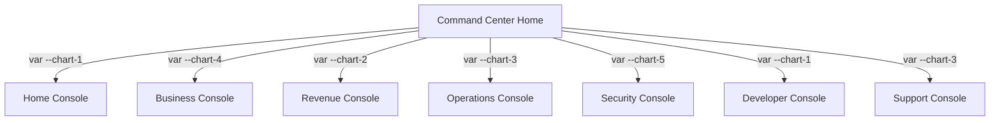

# EventOS Command Center: Architecture and UI Design Report

This report provides a comprehensive review of the design, structure, and user interface standards of the **EventOS Command Center**—the administrative hub of the multi-tenant SaaS conference platform.

---

## 1. Core Structural Layout (The Shell)

The Command Center is designed as a single-page workspace wrapper that manages authentication, layout responsiveness, and context-switching. The shell is orchestrated by the `SuperAdminLayout` ([layout.tsx](file:///d:/DEV/conf-platform/apps/cloud/command-center/app/%28command-center%29/layout.tsx)) and includes:

* **SuperAdminGuard**: An authorization barrier that verifies credentials, roles, and session status before mounting any content.
* **ConsoleProvider**: A React Context provider that tracks the active console, its accent color, and navigation mappings.
* **Desktop Sidebar**: A collapsible sidebar ([Sidebar.tsx](file:///d:/DEV/conf-platform/apps/cloud/command-center/components/layout/Sidebar.tsx)) that transitions between an expanded state (`248px` width, showing labels and full console switcher) and a compact state (`72px` width, showing tooltips and a collapsed icon logo).
* **Mobile Navigation**: On screens below `768px`, the sidebar is hidden and replaced by a slide-in bottom drawer using a Radix UI Sheet component (`SheetContent` side="left") triggered from the header.
* **Unified Header**: A sticky top navigation bar ([Header.tsx](file:///d:/DEV/conf-platform/apps/cloud/command-center/components/layout/Header.tsx)) housing:
  * **Breadcrumbs**: High-fidelity, dynamic route breadcrumbs that mirror the user's location.
  * **Command Palette**: An instantaneous lookup utility for quick search and keyboard-driven actions.
  * **Ask AI**: A direct shortcut (`Sparkles` icon) linking to the AI-assisted sales proposal generator.
  * **Timezone Clock**: A localized clock showing the current Indian Standard Time (IST) or selected timezone in a monospace font.
  * **Notification Center**: Real-time notifications pushed via Socket.IO.
  * **Theme Toggle Slider**: An interactive, rounded slider for switching between light and dark modes.
  * **User Dropdown Menu**: Direct access to user profile details, authentication policy, and secure sign-out.

---

## 2. Design Aesthetics & Visual Philosophy

The Command Center features a premium, theme-aware interface tailored for operators who manage data-heavy systems. Key visual standards defined in [globals.css](file:///d:/DEV/conf-platform/apps/cloud/command-center/app/globals.css) include:

### Typography
* **Sans-Serif (`Inter`)**: The primary font for all UI elements, headings, forms, and general content.
* **Monospace (`IBM Plex Mono`)**: The font for tabular numeric data, clocks, logs, database metrics, and version hashes, ensuring alignment and scannability.

### The Dark Mode Control Room
Unlike generic dark modes that rely on high-contrast blues, the EventOS dark theme is styled as a **Monochrome Enterprise Control Room**:
* **Graphite Surfaces**: Deep dark shades (`#080808`, `#111111`, `#171719`) create a layout with minimal glow.
* **Subtle Borders**: Borders are styled in dark grey (`#303034` or `#202024`) to separate panels without visual noise.
* **Restrained Accents**: Standard brand colors (blue, indigo, violet) are automatically translated into neutral slate colors (`#d4d4d8` and `#71717a` for charts) to avoid turning dashboard screens into a "Christmas tree" of color. Bright colors are strictly reserved for operational statuses (Green = Healthy, Amber = Warning, Red = Danger).

### Spacing & Geometry
* **Radius Tokens**: Smooth corner styling (`--radius-control: 0.5rem`, `--radius-panel: 0.75rem`, `--radius-card: 1rem`).
* **Page Spacing**: Flexible clamp padding (`clamp(1rem, 2.4vw, 2.5rem)`) adapts to varying display sizes.
* **Transition Timings**: Smooth micro-animations for interactions (`--motion-fast: 140ms`, `--motion-standard: 240ms`, `--motion-slow: 420ms`).
* **Density Settings**: Support for compact mode (`data-density="compact"`) reduces input heights from `2.75rem` to `2.25rem` and table row heights from `3.25rem` to `2.65rem` to maximize screen real estate.

---

## 3. The 7 Specialized Consoles

The Command Center divides platform administration into **7 distinct workspaces (Consoles)**. Each console possesses its own registry, accent colors, and navigation menu:

| Console | Icon | Accent Color | Focus Area & Key Pages |
| :--- | :--- | :--- | :--- |
| **Home (Command Center)** | `LayoutDashboard` | Blue (`var(--chart-1)`) | General dashboard overview, platform-wide health monitoring, live Socket.IO activity logs, organization directory, and analytics reports. |
| **Business Console** | `Building2` | Indigo (`var(--chart-4)`) | Commercial pipelines, CRM, service requests, quote calculator, subscription plans, add-ons, and customer entitlements. |
| **Revenue Console** | `Landmark` | Green (`var(--chart-2)`) | Invoices, transaction logs, payment gateway configurations, credit notes, taxation rules, and the financial audit trail. |
| **Operations Console** | `Gauge` | Amber (`var(--chart-3)`) | Service request dispatching, venue readiness monitoring, risk analysis, background job queues (Celery), database statistics, and storage checkups. |
| **Security Console** | `ShieldCheck` | Rose (`var(--chart-5)`) | Identity management, user directories, role/permission matrices, access reviews, audit logs, security events, and super-admin impersonation tools. |
| **Developer Console** | `Terminal` | Blue (`var(--chart-1)`) | API catalogs, developer API keys, webhooks, integration plugins, request logs, application registries, and feature flags. |
| **Support Console** | `Ticket` | Amber (`var(--chart-3)`) | Customer support tickets, SLA alert metrics, knowledge base content, and system announcements. |

---

## 4. Key UI Components & Primitives

The interface enforces rigorous standards for forms, metrics, timelines, and error boundaries, defined in `features/settings/routes/design-system/PageScreen.tsx`:

### KPI Cards (`KpiCard`)
Used in grids at the top of dashboards to represent critical metrics.
* Displays the primary metric value in large, bold text.
* Features a colored trend indicator showing delta change percentages (e.g., `+8.2%` green or `-4.6%` red).
* Integrates a miniature sparkline graph displaying trend fluctuations over time.
* Uses semantic coloring matched to the metric's health status.

### Premium Object Cards (`PremiumObjectCard`)
Toned, theme-aware cards designed to represent domain resources (like a contract invoice, database backup, or security workflow).
* Utilizes **Premium Asset Icons** (sculpted vector badges depicting documents, databases, workflows, deployments).
* Pairs a clear title and description with an metadata summary and status badge (e.g., "₹4,82,000 · GST included" with a "Paid" badge).

### Operational Status Rails (`OperationalStatusRail`)
Horizontal status elements that display live health parameters for background infrastructure (such as databases and workers).
* Employs colored icon highlights (Success, Warning, Danger) to immediately surface issues.
* Contains a title, details, and metadata column (e.g., database connection latency "42 ms").

### Form Fields & Validation
Form elements are built to support clean keyboard accessibility and server feedback:
* **FormField wrapper**: Programmatically binds form labels, help descriptions, required indicators, and field errors.
* **ServerErrorSummary**: Displays service-side error boundaries with retry buttons, resolving form failures gracefully.

### Audit Logs & Timelines
* **AuditPanel**: Renders sensitive, attributable actions showing the actor (e.g., "Platform administrator"), timestamp, reason, and security verification level (e.g., "MFA assured session").
* **OperationalTimeline**: Displays chronological step logs, highlighting completed, current, and pending steps with status markers.

### Page States (Async Boundaries)
To ensure the interface always displays correct context, it maps out three fallback components:
* **AsyncState**: A clean empty state containing illustration and call-to-actions.
* **PermissionDenied**: A security block displaying access requests and permission descriptions.
* **RecoverableError**: A dependency failure state that explains what failed and provides a "Retry" button.
