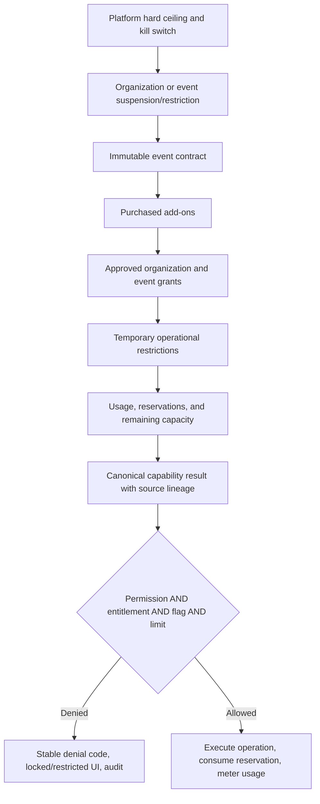
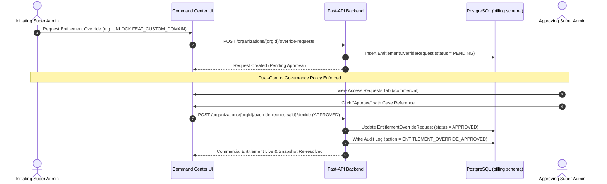

# Eventos Platform: Comprehensive Feature Entitlements & Commercial Locking Audit Report

## 1. Executive Summary & Architecture Overview

The Eventos Platform implements a **dual-tiered, multi-layer commercial entitlement and capability governance engine**. Entitlements answer **whether an organization or event contract has purchased access** to a feature or quota, whereas Role-Based Access Control (RBAC) permissions independently answer **whether the specific authenticated user has authorization** to execute the operation.

### Key Architectural Concepts
1. **Organization-Scoped Entitlements**: Applied across the entire tenant contract (e.g. `max_events`, `max_users`, `FEAT_CUSTOM_DOMAIN`, `FEAT_DEDICATED_MANAGER`).
2. **Event-Scoped Snapshot Sets**: Freeze commercial entitlements per event activation snapshot (`EventEntitlementSnapshotSet`). This ensures contract changes or plan upgrades/downgrades do not corrupt historical or currently live events without controlled snapshot re-resolution.
3. **Dual-Control Administrative Overrides**: Commercial entitlement overrides (`EntitlementOverrideRequest`) require independent super-admin approval in the Command Center before taking effect.
4. **Code-Owned Enforcement**: Route bindings, operation definitions (`FEATURE_DEFINITIONS`), backend enforcement locations (`OPERATION_ENFORCEMENT_SITES`), and required permissions (`OPERATION_PERMISSIONS`) are owned by code in [`capability_registry.py`](file:///d:/DEV/conf-platform/services/backend/app/modules/billing/capability_registry.py) and [`capabilities.tsx`](file:///d:/DEV/conf-platform/apps/cloud/organiser-portal/lib/capabilities.tsx). Admin catalog modifications cannot bypass enforcement.

---

## 2. Complete Feature Entitlements Catalog (53 Features)

Below is the exhaustive catalog of all feature capability keys, what they do, why they were added to the platform, their value types, scopes, and implementation locations across Command Center and Organiser Portal.

### Category 1: Platform Limits & Core Architecture

#### 1. `FEAT_EVENT_PLANNING`
- **What It Does**: Unlocks event planning, event detail management, agenda structure, and core event configuration routes.
- **Why Added**: Defines the core baseline tier for event management. Prevents un-entitled tenants from creating or managing event structures.
- **Value Type**: `BOOLEAN` | **Scope**: `EVENT`
- **Allowed Values / Tiers**: Enabled (`True`) or Restricted (`False`).
- **Command Center Implementation**: Managed in Commercial Matrix ([`PageScreen.tsx`](file:///d:/DEV/conf-platform/apps/cloud/command-center/features/organizations/routes/commercial/PageScreen.tsx#L372)) and Plan Feature builder ([`PlansScreen.tsx`](file:///d:/DEV/conf-platform/apps/cloud/command-center/features/business/subscription/screens/PlansScreen.tsx#L180)).
- **Organiser Portal Implementation**: Bound to `/events/:eventId`, `/events/:eventId/dashboard`, `/events/:eventId/planning`, `/events/:eventId/planning/details`, `/events/:eventId/planning/timeline` in [`capabilities.tsx`](file:///d:/DEV/conf-platform/apps/cloud/organiser-portal/lib/capabilities.tsx#L44-L47). Gated via `CapabilityBoundary`.
- **Backend Enforcement**: [`modules/rbac/routers/events.py:update_event`](file:///d:/DEV/conf-platform/services/backend/app/modules/rbac/routers/events.py) (Operation: `events.planning.manage`, Permission: `EVENTS:EDIT`).

#### 2. `FEAT_EVENT_WEBSITE`
- **What It Does**: Controls the sophistication and visual capabilities of public event microsites.
- **Why Added**: Drives plan differentiation across Basic (standard template), Professional (custom layout), and Enterprise (fully custom branded microsites).
- **Value Type**: `TIER` | **Scope**: `EVENT`
- **Allowed Values / Tiers**: `BASIC`, `CUSTOMIZABLE`, `FULLY_BRANDED`.
- **Command Center Implementation**: Configured per subscription plan tier in [`PlansScreen.tsx`](file:///d:/DEV/conf-platform/apps/cloud/command-center/features/business/subscription/screens/PlansScreen.tsx).
- **Organiser Portal Implementation**: Gated on route `/events/:eventId/design-studio/portals` using `TierGate`.
- **Backend Enforcement**: Validated during design studio portal publish operations.

#### 3. `FEAT_CUSTOM_DOMAIN`
- **What It Does**: Enables tenant organizations to attach custom SSL domains (e.g. `conf.company.com`) to portals and event landing pages instead of platform subdomains.
- **Why Added**: Premium monetization hook for enterprise customers requiring brand white-labeling and corporate security compliance.
- **Value Type**: `BOOLEAN` | **Scope**: `ORGANIZATION`
- **Allowed Values / Tiers**: Enabled / Restricted.
- **Command Center Implementation**: Enabled under Organization Commercial Settings.
- **Organiser Portal Implementation**: Checked in Organization Settings (`/settings`). Form input is disabled with an upgrade prompt if not entitled.
- **Backend Enforcement**: Validated during domain binding requests in organization router.

#### 4. `FEAT_WHITE_LABEL`
- **What It Does**: Removes all "Powered by Eventos" footers, watermarks, and platform branding from attendee, speaker, and registration portals.
- **Why Added**: Enterprise tier requirement for white-label event agencies and large enterprise organizers.
- **Value Type**: `BOOLEAN` | **Scope**: `BOTH` (Organization & Event)
- **Allowed Values / Tiers**: Enabled / Restricted.
- **Command Center Implementation**: Managed in subscription plan feature matrix.
- **Organiser Portal Implementation**: Evaluated when rendering design studio preview and portal header/footer settings.
- **Backend Enforcement**: Stripped from generated portal HTML/CSS templates.

---

### Category 2: Registration & Participant Management

#### 5. `FEAT_REGISTRATION_PORTAL`
- **What It Does**: Enables attendee self-registration, ticket selection, and attendee portal access.
- **Why Added**: Core revenue monetization module. Tiered functionality allows basic free registrations vs complex paid multi-tier registrations.
- **Value Type**: `TIER` | **Scope**: `EVENT`
- **Allowed Values / Tiers**: `BASIC`, `ADVANCED`, `ENTERPRISE`.
- **Command Center Implementation**: Subscription plan capability mapping.
- **Organiser Portal Implementation**: Gates `/events/:eventId/registration` route.
- **Backend Enforcement**: Enforces `registration.read`, `registration.manage`, `registration.submit`, `registration.approve` operations.

#### 6. `FEAT_REGISTRATION_FORMS`
- **What It Does**: Allows organizers to construct custom registration forms with conditional logic, custom input fields, and file upload fields.
- **Why Added**: Monetizes custom data collection. Basic plans get 10 standard fields; Professional/Enterprise get unlimited custom form fields.
- **Value Type**: `TIER` | **Scope**: `EVENT`
- **Allowed Values / Tiers**: `STANDARD`, `CUSTOM`.
- **Organiser Portal Implementation**: Gates `/events/:eventId/registration/form-builder`.
- **Backend Enforcement**: [`modules/registration/routers/registration_portal.py:update_form_config`](file:///d:/DEV/conf-platform/services/backend/app/modules/registration/routers/registration_portal.py) (Operation: `registration.forms.manage`, Permission: `REG_CONFIG:FORM`).

#### 7. `FEAT_TICKET_CATEGORIES` (Mapped to Quota Limit `max_ticket_categories`)
- **What It Does**: Limits how many distinct ticket types (e.g. VIP, General Admission, Student, Virtual) can be created per event.
- **Why Added**: Controls registration complexity and incentivizes higher tier plan upgrades (Basic: 3, Professional: 10, Enterprise: Unlimited).
- **Value Type**: `LIMIT` | **Scope**: `EVENT`
- **Backend Enforcement**: [`modules/registration/routers/participant_roles.py:create_participant_role`](file:///d:/DEV/conf-platform/services/backend/app/modules/registration/routers/participant_roles.py) (Operation: `registration.ticket_types.manage`, Permission: `REG_CONFIG:EDIT`).

#### 8. `FEAT_COUPON_CODES`
- **What It Does**: Allows creation and management of promotional discount codes and coupon campaigns for registration fees.
- **Why Added**: Professional and Enterprise feature for paid commercial conferences.
- **Value Type**: `BOOLEAN` | **Scope**: `EVENT`
- **Organiser Portal Implementation**: Financials tab coupon creation button is locked or hidden for Basic tier events.
- **Backend Enforcement**: [`modules/registration/routers/payments.py:promo_mutations`](file:///d:/DEV/conf-platform/services/backend/app/modules/registration/routers/payments.py) (Operation: `registration.coupons.manage`, Permission: `PAYMENTS:PRICING`).

#### 9. `FEAT_PAYMENT_GATEWAY`
- **What It Does**: Integrates Stripe, Razorpay, and payment gateway gateways for collecting paid event registration fees.
- **Why Added**: Essential commercial feature for paid events.
- **Value Type**: `BOOLEAN` | **Scope**: `EVENT`
- **Backend Enforcement**: [`modules/registration/routers/payments.py:update_payment_config`](file:///d:/DEV/conf-platform/services/backend/app/modules/registration/routers/payments.py) (Operation: `registration.payments.manage`, Permission: `PAYMENTS:PRICING`).

#### 10. `FEAT_REGISTRATION_ANALYTICS`
- **What It Does**: Provides live registration conversion funnels, revenue metrics, demographic breakdown, and attendance analytics dashboards.
- **Why Added**: Higher-tier business intelligence upsell.
- **Value Type**: `TIER` | **Scope**: `EVENT` (`BASIC`, `ADVANCED`)
- **Organiser Portal Implementation**: Gates `/events/:eventId/registration/dashboard`.
- **Backend Enforcement**: [`modules/registration/routers/participants.py:registration_analytics`](file:///d:/DEV/conf-platform/services/backend/app/modules/registration/routers/participants.py) (Operation: `registration.analytics.view`, Permission: `ANALYTICS:REG_DASHBOARD`).

#### 11. `FEAT_BULK_IMPORT`
- **What It Does**: Allows importing hundreds or thousands of attendees via CSV/Excel spreadsheets.
- **Why Added**: Efficiency tool for enterprise organizers migrating attendee lists.
- **Value Type**: `BOOLEAN` | **Scope**: `EVENT`
- **Backend Enforcement**: [`modules/registration/routers/participants.py:participant_imports`](file:///d:/DEV/conf-platform/services/backend/app/modules/registration/routers/participants.py) (Operation: `registration.import`, Permission: `PARTICIPANTS:IMPORT`).

#### 12. `FEAT_QR_CONFIRMATION`
- **What It Does**: Generates unique encrypted QR codes inside attendee confirmation emails for instant venue entry scanning.
- **Why Added**: Standard operational security feature included across all plans.
- **Value Type**: `BOOLEAN` | **Scope**: `EVENT`

#### 13. `FEAT_ATTENDEE_CHECKIN`
- **What It Does**: Enables manual and QR-code kiosk attendance check-in systems at venue doors.
- **Why Added**: Tiered functionality (`BASIC` manual check-in vs `ADVANCED`/`ENTERPRISE` multi-device kiosk sync).
- **Value Type**: `TIER` | **Scope**: `EVENT` (`BASIC`, `ADVANCED`, `ENTERPRISE`)
- **Organiser Portal Implementation**: Gates `/events/:eventId/registration/review`.
- **Backend Enforcement**: [`modules/venue/routers/attendance.py:attendance_router`](file:///d:/DEV/conf-platform/services/backend/app/modules/venue/routers/attendance.py) (Operation: `registration.checkin`, Permission: `CHECKIN:MANUAL`).

---

### Category 3: Speaker & Presentation Management

#### 14. `FEAT_SPEAKER_PORTAL`
- **What It Does**: Provides a dedicated portal where speakers log in, update bios, submit slides, and review schedule details.
- **Why Added**: Key differentiator for academic, scientific, and corporate medical conferences.
- **Value Type**: `TIER` | **Scope**: `EVENT` (`PARTIAL`, `FULL`)
- **Organiser Portal Implementation**: Gates `/events/:eventId/speakers`.
- **Backend Enforcement**: Enforces `speakers.manage` operation (Permission: `SPEAKERS:EDIT`).

#### 15. `FEAT_ABSTRACT_SUBMISSION`
- **What It Does**: Manages academic call for papers, paper submissions, peer reviews, and abstract selection workflows.
- **Why Added**: Specialized high-value module for medical and academic association conferences.
- **Value Type**: `TIER` | **Scope**: `EVENT` (`BASIC`, `ADVANCED`)
- **Organiser Portal Implementation**: Gates `/events/:eventId/speakers/dashboard`.

#### 16. `FEAT_FILE_UPLOADS` (Monitored by `storage_quota_mb`)
- **What It Does**: Enables speakers to upload PowerPoint, PDF, Keynote, and video files directly into the presentation management vault.
- **Why Added**: Storage cost isolation and file handling controls.
- **Value Type**: `BOOLEAN` | **Scope**: `EVENT`
- **Backend Enforcement**: [`modules/presentations/routers/files.py:request_upload_url`](file:///d:/DEV/conf-platform/services/backend/app/modules/presentations/routers/files.py) (Operation: `presentations.upload`, Permission: `FILES:CREATE`).

#### 17. `FEAT_PRESENTATION_VALIDATION`
- **What It Does**: Performs deep automated file scanning (checking slide dimensions 16:9 vs 4:3, missing fonts, embedded media, corrupt slides).
- **Why Added**: Premium technical safety feature for smooth main-stage projection.
- **Value Type**: `TIER` | **Scope**: `EVENT` (`BASIC`, `ADVANCED`)
- **Backend Enforcement**: [`modules/presentations/routers/files.py:file_review_mutations`](file:///d:/DEV/conf-platform/services/backend/app/modules/presentations/routers/files.py) (Operation: `presentations.validate`, Permission: `FILES:APPROVE`).

#### 18. `FEAT_SPEAKER_DASHBOARD`
- **What It Does**: Provides self-service speaker dashboard for viewing session timings, room assignments, and reviewer notes.
- **Value Type**: `TIER` | **Scope**: `EVENT` (`BASIC`, `ADVANCED`)
- **Organiser Portal Implementation**: Gates `/events/:eventId/speakers/dashboard` and `/events/:eventId/speakers/analytics`.

#### 19. `FEAT_SPEAKER_COMMS`
- **What It Does**: Automated email triggers to speakers (e.g. upload reminders, schedule change alerts, slide rejection notifications).
- **Value Type**: `TIER` | **Scope**: `EVENT` (`BASIC`, `ADVANCED`)

#### 20. `FEAT_SPEAKER_PROFILES`
- **What It Does**: Controls public speaker directory layout and custom fields on the public event website.
- **Value Type**: `TIER` | **Scope**: `EVENT` (`BASIC`, `CUSTOMIZABLE`, `FULLY_CUSTOM`)
- **Organiser Portal Implementation**: Gates `/events/:eventId/speakers/list`.

#### 21. `FEAT_MULTI_PRESENTATION_VERSIONS`
- **What It Does**: Allows speakers to keep revision history of uploaded slides (v1, v2, v3) instead of replacing files.
- **Why Added**: Advanced feature for multi-track conferences.
- **Value Type**: `BOOLEAN` | **Scope**: `EVENT`

#### 22. `FEAT_EPOSTER_MGMT`
- **What It Does**: Manages electronic poster (ePoster) submissions, digital poster hall display, and touchscreen kiosk presentation queues.
- **Why Added**: Specialized add-on capability for scientific and healthcare summits.
- **Value Type**: `BOOLEAN` | **Scope**: `EVENT`
- **Organiser Portal Implementation**: Gates `/events/:eventId/speakers/eposters`.
- **Backend Enforcement**: [`modules/presentations/routers/posters.py:posters_router`](file:///d:/DEV/conf-platform/services/backend/app/modules/presentations/routers/posters.py) (Operation: `eposters.manage`, Permission: `POSTERS:EDIT`).

---

### Category 4: Badging, Certificates & Printing

#### 23. `FEAT_BADGE_TEMPLATES` (Mapped to Quota Limit `max_badge_templates`)
- **What It Does**: Controls the maximum number of custom badge design templates that can be saved per event.
- **Why Added**: Tiered monetization (Basic: 3 templates, Professional/Enterprise: Unlimited).
- **Value Type**: `LIMIT` | **Scope**: `EVENT`
- **Organiser Portal Implementation**: Gates `/events/:eventId/design-studio/badges` and `/events/:eventId/registration/template-designer`.
- **Backend Enforcement**: [`modules/registration/routers/print_templates.py:_enforce_template_operation`](file:///d:/DEV/conf-platform/services/backend/app/modules/registration/routers/print_templates.py) (Operations: `badges.templates.read`, `badges.templates.manage`, Permission: `BADGES:TEMPLATES`).

#### 24. `FEAT_CERTIFICATE_TEMPLATES` (Mapped to Quota Limit `max_certificate_templates`)
- **What It Does**: Limits how many certificate templates (e.g. Attendance, Speaker, CME Credit, Winner) can be configured.
- **Value Type**: `LIMIT` | **Scope**: `EVENT`
- **Organiser Portal Implementation**: Gates `/events/:eventId/design-studio/certificates`.
- **Backend Enforcement**: [`modules/registration/routers/print_templates.py:_enforce_template_operation`](file:///d:/DEV/conf-platform/services/backend/app/modules/registration/routers/print_templates.py) (Operations: `certificates.templates.read`, `certificates.templates.manage`, Permission: `BADGES:TEMPLATES`).

#### 25. `FEAT_CUSTOM_BADGE_DESIGN`
- **What It Does**: Enables WYSIWYG visual designer drag-and-drop for dynamic badge elements, backgrounds, and dual-sided badges.
- **Value Type**: `BOOLEAN` | **Scope**: `EVENT`

#### 26. `FEAT_CUSTOM_CERT_DESIGN`
- **What It Does**: Enables custom canvas certificate designer with dynamic place-holders (name, session title, hours).
- **Value Type**: `BOOLEAN` | **Scope**: `EVENT`

#### 27. `FEAT_QR_BADGE`
- **What It Does**: Embeds scannable 2D QR codes on physical badge templates for lead retrieval and attendance tracking.
- **Value Type**: `BOOLEAN` | **Scope**: `EVENT`

#### 28. `FEAT_BULK_BADGE_EXPORT`
- **What It Does**: Generates high-resolution PDF print sheets and ZIP archives for pre-printing badges prior to the event.
- **Value Type**: `BOOLEAN` | **Scope**: `EVENT`
- **Backend Enforcement**: [`modules/registration/routers/badges.py:export_badge_manifest`](file:///d:/DEV/conf-platform/services/backend/app/modules/registration/routers/badges.py) (Operation: `badges.export`, Permission: `BADGES:EXPORT`).

#### 29. `FEAT_AUTO_CERTIFICATE`
- **What It Does**: Automatically issues downloadable PDF certificates to attendees upon verified session/event check-in.
- **Value Type**: `BOOLEAN` | **Scope**: `EVENT`
- **Organiser Portal Implementation**: Gates `/events/:eventId/registration/certificates`.
- **Backend Enforcement**: [`modules/registration/routers/print_templates.py:authorize_certificate_generation`](file:///d:/DEV/conf-platform/services/backend/app/modules/registration/routers/print_templates.py) (Operation: `certificates.generate`, Permission: `BADGES:GENERATE`).

---

### Category 5: Communications, Campaigns & Messaging

#### 30. `FEAT_EMAIL_NOTIFICATIONS` (Mapped to Quota Limit `max_emails_per_event`)
- **What It Does**: Enables sending automated transactional emails (confirmations, password resets, ticket delivery).
- **Value Type**: `LIMIT` | **Scope**: `EVENT`
- **Backend Enforcement**: [`modules/notifications/routers/notifications.py:get_analytics`](file:///d:/DEV/conf-platform/services/backend/app/modules/notifications/routers/notifications.py) (Operations: `communications.email.read`, `communications.email.send`, Permission: `CAMPAIGNS:SEND`).

#### 31. `FEAT_REMINDER_EMAILS`
- **What It Does**: Schedules automated pre-event and pre-session email reminders.
- **Value Type**: `BOOLEAN` | **Scope**: `EVENT`

#### 32. `FEAT_CAMPAIGN_MGMT`
- **What It Does**: Full marketing email campaign manager with audience segmentation, scheduling, and email template editor.
- **Value Type**: `BOOLEAN` | **Scope**: `EVENT`
- **Organiser Portal Implementation**: Gates `/events/:eventId/communication/emails`, `/events/:eventId/communication/email-designer`, `/events/:eventId/design-studio/emails`.
- **Backend Enforcement**: [`modules/notifications/routers/notifications.py:campaign_mutations`](file:///d:/DEV/conf-platform/services/backend/app/modules/notifications/routers/notifications.py) (Operation: `communications.campaign.manage`, Permission: `CAMPAIGNS:EDIT`).

#### 33. `FEAT_BULK_EMAIL`
- **What It Does**: Allows broadcasting bulk emails to all registered participants or selected sub-groups.
- **Value Type**: `BOOLEAN` | **Scope**: `EVENT`
- **Backend Enforcement**: [`modules/notifications/routers/notifications.py:campaign_send_mutations`](file:///d:/DEV/conf-platform/services/backend/app/modules/notifications/routers/notifications.py) (Operation: `communications.bulk_email.send`, Permission: `CAMPAIGNS:SEND`).

#### 34. `FEAT_ANNOUNCEMENT_CENTER`
- **What It Does**: Controls live push announcements displayed inside attendee web/mobile portals during the event.
- **Value Type**: `BOOLEAN` | **Scope**: `EVENT`
- **Organiser Portal Implementation**: Gates `/events/:eventId/communication/announcements`.
- **Backend Enforcement**: [`modules/notifications/routers/announcements.py:announcements_router`](file:///d:/DEV/conf-platform/services/backend/app/modules/notifications/routers/announcements.py) (Operations: `announcements.read`, `announcements.manage`, Permission: `ANNOUNCEMENTS:EDIT`).

#### 35. `FEAT_PUSH_NOTIFICATIONS` (Monitored by `push_sent`)
- **What It Does**: Mobile push notification delivery system to mobile attendee apps.
- **Value Type**: `BOOLEAN` | **Scope**: `EVENT`

#### 36. `FEAT_WHATSAPP` (Monitored by Quota Limit `max_whatsapp_per_event`)
- **What It Does**: Integrates official WhatsApp Business API for sending instant ticket confirmations and session updates via WhatsApp.
- **Why Added**: Premium messaging add-on due to per-message Meta API costs.
- **Value Type**: `BOOLEAN` | **Scope**: `EVENT`

#### 37. `FEAT_SMS` (Monitored by Quota Limit `max_sms_per_event`)
- **What It Does**: SMS gateway integration for transactional SMS and two-factor authentication.
- **Why Added**: Direct carrier cost isolation. Managed as an add-on or Enterprise tier entitlement.
- **Value Type**: `BOOLEAN` | **Scope**: `EVENT`

---

### Category 6: Branding & Design Studio

#### 38. `FEAT_DEFAULT_THEME`
- **What It Does**: Standard default visual theme available across all portal tiers.
- **Value Type**: `BOOLEAN` | **Scope**: `EVENT`
- **Organiser Portal Implementation**: Gates `/events/:eventId/design-studio/theme`.

#### 39. `FEAT_THEME_CUSTOMIZATION`
- **What It Does**: Unlocks full CSS theme customization and layout tweaking.
- **Value Type**: `BOOLEAN` | **Scope**: `EVENT`
- **Backend Enforcement**: [`modules/rbac/routers/events.py:update_event`](file:///d:/DEV/conf-platform/services/backend/app/modules/rbac/routers/events.py) (Operation: `branding.theme.manage`, Permission: `EVENTS:EDIT`).

#### 40. `FEAT_CUSTOM_COLORS`
- **What It Does**: Custom color palette selection for matching primary, secondary, and surface corporate branding.
- **Value Type**: `BOOLEAN` | **Scope**: `EVENT`
- **Backend Enforcement**: [`modules/rbac/routers/events.py:update_event`](file:///d:/DEV/conf-platform/services/backend/app/modules/rbac/routers/events.py) (Operation: `branding.colors.manage`, Permission: `EVENTS:EDIT`).

#### 41. `FEAT_CUSTOM_FONTS`
- **What It Does**: Allows embedding custom Google or corporate web fonts across event web pages.
- **Value Type**: `TIER` | **Scope**: `EVENT` (`LIMITED`, `UNLIMITED`)
- **Backend Enforcement**: [`modules/rbac/routers/events.py:update_event`](file:///d:/DEV/conf-platform/services/backend/app/modules/rbac/routers/events.py) (Operation: `branding.fonts.manage`, Permission: `EVENTS:EDIT`).

#### 42. `FEAT_LOGO_BRANDING`
- **What It Does**: Logo placement on navigation bars, receipts, tickets, and emails.
- **Value Type**: `TIER` | **Scope**: `BOTH` (`BASIC`, `ADVANCED`, `WHITE_LABEL`)
- **Backend Enforcement**: [`modules/rbac/routers/events.py:branding_uploads`](file:///d:/DEV/conf-platform/services/backend/app/modules/rbac/routers/events.py) (Operation: `branding.logo.manage`, Permission: `EVENTS:EDIT`).

#### 43. `FEAT_CUSTOM_LOGIN_PAGE`
- **What It Does**: Dedicated customized organization login experience (`login.company.com`).
- **Value Type**: `BOOLEAN` | **Scope**: `ORGANIZATION`

---

### Category 7: Developer, API & Operations

#### 44. `FEAT_API_ACCESS` (Monitored by `max_api_calls_per_month`)
- **What It Does**: Unlocks REST API keys and developer access for programmatically fetching registrations, speakers, and events.
- **Why Added**: Enterprise developer monetization and rate limiting.
- **Value Type**: `BOOLEAN` | **Scope**: `ORGANIZATION`
- **Backend Enforcement**: [`modules/developer/routers/developer.py:developer_router`](file:///d:/DEV/conf-platform/services/backend/app/modules/developer/routers/developer.py) (Operation: `developer.api.use`, Permission: `DEVELOPER:API_USE`).

#### 45. `FEAT_WEBHOOK_ACCESS` (Monitored by `max_webhook_deliveries_per_month`)
- **What It Does**: Real-time event webhooks (e.g. `registration.created`, `payment.success`, `checkin.completed`).
- **Value Type**: `BOOLEAN` | **Scope**: `BOTH`
- **Organiser Portal Implementation**: Gates `/events/:eventId/developer`.
- **Backend Enforcement**: [`modules/notifications/routers/webhooks.py:webhooks_router`](file:///d:/DEV/conf-platform/services/backend/app/modules/notifications/routers/webhooks.py) (Operation: `developer.webhooks.manage`, Permission: `DEVELOPER:WEBHOOKS_MANAGE`).

#### 46. `FEAT_THIRD_PARTY_INTEGRATIONS` (Monitored by `max_integrations`)
- **What It Does**: Native integration connectors (Salesforce, HubSpot, Zoom, Zapier, Marketo).
- **Value Type**: `BOOLEAN` | **Scope**: `BOTH`
- **Backend Enforcement**: [`modules/platform/organization_console_router.py:integration_connection_mutations`](file:///d:/DEV/conf-platform/services/backend/app/modules/platform/organization_console_router.py) (Operation: `integrations.manage`, Permission: `DEVELOPER:INTEGRATIONS_MANAGE`).

#### 47. `FEAT_SESSION_QUEUE`
- **What It Does**: Real-time onsite slide queue manager for technician desks in presentation rooms.
- **Value Type**: `BOOLEAN` | **Scope**: `EVENT`
- **Backend Enforcement**: [`modules/presentations/routers/queue.py:queue_router`](file:///d:/DEV/conf-platform/services/backend/app/modules/presentations/routers/queue.py) (Operation: `presentations.queue.manage`, Permission: `QUEUE:EDIT`).

#### 48. `FEAT_SESSION_MANAGEMENT`
- **What It Does**: Multi-track session scheduling, room assignment, speaker conflict detection, and agenda management.
- **Value Type**: `BOOLEAN` | **Scope**: `EVENT`
- **Organiser Portal Implementation**: Gates `/events/:eventId/sessions`, `/events/:eventId/sessions/agenda`, `/events/:eventId/sessions/dashboard`.
- **Backend Enforcement**: [`modules/speakers/routers/sessions.py:sessions_router`](file:///d:/DEV/conf-platform/services/backend/app/modules/speakers/routers/sessions.py) (Operation: `sessions.manage`, Permission: `SESSIONS:EDIT`).

#### 49. `FEAT_COMMUNICATION_CENTER`
- **What It Does**: Central communications dashboard for tracking overall email, SMS, and push delivery logs across an event.
- **Value Type**: `BOOLEAN` | **Scope**: `EVENT`
- **Organiser Portal Implementation**: Gates `/events/:eventId/communication`, `/events/:eventId/communication/dashboard`, `/events/:eventId/communication/notifications`.

#### 50. `FEAT_DATA_EXPORTS` (Monitored by `max_exports_per_event`)
- **What It Does**: Generating CSV/Excel/JSON exports of sessions, speakers, registrations, and financial transactions.
- **Value Type**: `BOOLEAN` | **Scope**: `EVENT`
- **Organiser Portal Implementation**: Gates `/events/:eventId/speakers/export`.
- **Backend Enforcement**: [`modules/speakers/routers/sessions.py:export_agenda`](file:///d:/DEV/conf-platform/services/backend/app/modules/speakers/routers/sessions.py) (Operation: `exports.create`, Permission: `ANALYTICS:EXPORT`).

#### 51. `FEAT_VENUE_SYNC` (Monitored by `max_devices_per_event`)
- **What It Does**: Onsite venue server synchronization, room display signage sync, and scanner device pairing.
- **Value Type**: `BOOLEAN` | **Scope**: `EVENT`
- **Organiser Portal Implementation**: Gates `/events/:eventId/sessions/rooms`.
- **Backend Enforcement**: [`modules/venue/routers/sync.py:venue_sync`](file:///d:/DEV/conf-platform/services/backend/app/modules/venue/routers/sync.py), [`rooms.py`](file:///d:/DEV/conf-platform/services/backend/app/modules/venue/routers/rooms.py), [`rooms_devices.py`](file:///d:/DEV/conf-platform/services/backend/app/modules/venue/routers/rooms_devices.py) (Operations: `venue.sync`, `venue.rooms.manage`, `venue.devices.manage`, Permission: `DEVICES:EDIT` / `ROOMS:EDIT`).

---

### Category 8: Support & SLA Entitlements

#### 52. `FEAT_DEDICATED_MANAGER`
- **What It Does**: Assigns a dedicated technical account manager for support tickets and event-day hotline support.
- **Value Type**: `BOOLEAN` | **Scope**: `ORGANIZATION`
- **Backend Enforcement**: [`modules/platform/support_router.py:create_ticket`](file:///d:/DEV/conf-platform/services/backend/app/modules/platform/support_router.py) (Operation: `support.dedicated_manager`).

#### 53. `FEAT_SLA`
- **What It Does**: Applies guaranteed response time SLAs (e.g. 15-minute response for mission-critical event incidents).
- **Value Type**: `TIER` | **Scope**: `ORGANIZATION` (`STANDARD`, `PRIORITY`, `MISSION_CRITICAL`)
- **Backend Enforcement**: [`modules/platform/support_router.py:create_ticket`](file:///d:/DEV/conf-platform/services/backend/app/modules/platform/support_router.py) (Operation: `support.sla.apply`).

---

## 3. Complete Quota & Limit Entitlements (19 Limits)

The table below lists all numeric platform limits, their evaluation scopes, unit of measurement, default plan allocations, and backend safety ceilings.

| Limit Key | Catalog Mapping Key | Scope | Period | Basic Plan | Professional Plan | Enterprise Plan | Platform Hard Safety Ceiling |
|---|---|---|---|---|---|---|---|
| `max_events` | `LIMIT_EVENTS` | `ORGANIZATION` | `CONTRACT` | 1 | 10 | 50 | **10,000** |
| `max_users` | `LIMIT_ORGANIZER_USERS` | `ORGANIZATION` | `CONTRACT` | 2 | 10 | 50 | **1,000,000** |
| `max_event_team_members` | `LIMIT_EVENT_TEAM_MEMBERS` | `EVENT` | `EVENT` | 2 | 15 | 100 | **100,000** |
| `max_registrations` | `LIMIT_REGISTRATIONS` | `EVENT` | `EVENT` | 150 | 1,000 | 10,000+ | **10,000,000** |
| `max_speakers` | `LIMIT_SPEAKERS` | `EVENT` | `EVENT` | 30 | 100 | 500 | **100,000** |
| `max_sessions` | `LIMIT_SESSIONS` | `EVENT` | `EVENT` | 25 | 100 | 1,000+ | **100,000** |
| `max_rooms` | `LIMIT_ROOMS` | `EVENT` | `EVENT` | 5 | 20 | 100+ | **10,000** |
| `max_ticket_categories` | `FEAT_TICKET_CATEGORIES` | `EVENT` | `EVENT` | 3 | 10 | Unlimited | **10,000** |
| `max_badge_templates` | `FEAT_BADGE_TEMPLATES` | `EVENT` | `EVENT` | 3 | Unlimited | Unlimited | **10,000** |
| `max_certificate_templates` | `FEAT_CERTIFICATE_TEMPLATES` | `EVENT` | `EVENT` | 3 | Unlimited | Unlimited | **10,000** |
| `max_emails_per_event` | `FEAT_EMAIL_NOTIFICATIONS` | `EVENT` | `EVENT` | 450 | 5,000 | 100,000 | **100,000,000** |
| `storage_quota_mb` | `LIMIT_STORAGE` | `EVENT` | `EVENT` | 10,240 MB (10GB) | 51,200 MB (50GB) | 204,800 MB (200GB) | **10,485,760 MB (10TB)** |
| `max_sms_per_event` | `LIMIT_SMS` | `EVENT` | `EVENT` | 0 | Optional Add-on | Included | **10,000,000** |
| `max_whatsapp_per_event` | `LIMIT_WHATSAPP` | `EVENT` | `EVENT` | 0 | Optional Add-on | Included | **10,000,000** |
| `max_api_calls_per_month` | `LIMIT_API_CALLS_MONTHLY` | `ORGANIZATION` | `BILLING_PERIOD` | 0 | 10,000 | 1,000,000 | **1,000,000,000** |
| `max_webhook_deliveries_per_month` | `LIMIT_WEBHOOK_DELIVERIES_MONTHLY` | `ORGANIZATION` | `BILLING_PERIOD` | 0 | 10,000 | 1,000,000 | **1,000,000,000** |
| `max_integrations` | `LIMIT_INTEGRATIONS` | `ORGANIZATION` | `CONTRACT` | 0 | 3 | 10 | **10,000** |
| `max_exports_per_event` | `LIMIT_EXPORTS` | `EVENT` | `EVENT` | 10 | 100 | Unlimited | **1,000,000** |
| `max_devices_per_event` | `LIMIT_DEVICES` | `EVENT` | `EVENT` | 2 | 10 | 50 | **100,000** |

---

## 4. Organisation Portal Locked Features Matrix

This table maps every feature section in the **Organiser Portal** to its exact required entitlement key, how the frontend locks the feature, and what error code is rendered upon an entitlement block.

| Portal Route / Section | Required Entitlement Key | Frontend Lock Component | UI Locked Behavior | Reason Code |
|---|---|---|---|---|
| `/events/:eventId/planning` | `FEAT_EVENT_PLANNING` | `CapabilityBoundary` | Full screen lock banner with upgrade prompt | `NOT_ENTITLED` / `CONTRACT_REQUIRED` |
| `/events/:eventId/design-studio/portals` | `FEAT_EVENT_WEBSITE` | `TierGate` | Disables custom styling & publishes default layout | `NOT_ENTITLED` |
| `/settings` (Custom Domain) | `FEAT_CUSTOM_DOMAIN` | `useOrganizationFeatureAccess` | Inputs disabled, badge showing "Upgrade required" | `NOT_ENTITLED` |
| `/events/:eventId/design-studio/portals` (White Labeling) | `FEAT_WHITE_LABEL` | `FeatureGate` | "Powered by Eventos" watermark cannot be removed | `NOT_ENTITLED` |
| `/events/:eventId/registration` | `FEAT_REGISTRATION_PORTAL` | `CapabilityBoundary` | Route blocked; attendee registration links disabled | `NOT_ENTITLED` |
| `/events/:eventId/registration/form-builder` | `FEAT_REGISTRATION_FORMS` | `CapabilityBoundary` | Form builder disabled; restricted to standard 10 fields | `NOT_ENTITLED` |
| Ticket Types Creation | `max_ticket_categories` | `LimitGate` | "Add Ticket Type" button disabled, tooltip: "Category limit reached" | `QUOTA_EXHAUSTED` |
| Promotional Discounts | `FEAT_COUPON_CODES` | `FeatureGate` | Coupon creation tab locked behind upgrade prompt | `NOT_ENTITLED` |
| Payment Gateway Config | `FEAT_PAYMENT_GATEWAY` | `FeatureGate` | Gateway connection buttons disabled | `NOT_ENTITLED` |
| `/events/:eventId/registration/dashboard` | `FEAT_REGISTRATION_ANALYTICS` | `CapabilityBoundary` | Analytics charts blurred or locked | `NOT_ENTITLED` |
| Bulk CSV Import | `FEAT_BULK_IMPORT` | `CapabilityAction` | "Import CSV" button disabled with lock tooltip | `NOT_ENTITLED` |
| `/events/:eventId/registration/review` (Check-in) | `FEAT_ATTENDEE_CHECKIN` | `CapabilityBoundary` | Onsite check-in screen locked | `NOT_ENTITLED` |
| `/events/:eventId/speakers` | `FEAT_SPEAKER_PORTAL` | `CapabilityBoundary` | Speaker management portal disabled | `NOT_ENTITLED` |
| `/events/:eventId/speakers/dashboard` (Abstracts) | `FEAT_ABSTRACT_SUBMISSION` | `CapabilityBoundary` | Abstract collection workflow disabled | `NOT_ENTITLED` |
| File Uploads / Presentations | `FEAT_FILE_UPLOADS` / `storage_quota_mb` | `LimitGate` & `CapabilityAction` | Upload button disabled; "Storage quota full" alert | `QUOTA_EXHAUSTED` |
| `/events/:eventId/speakers/eposters` | `FEAT_EPOSTER_MGMT` | `CapabilityBoundary` | ePoster module locked | `NOT_ENTITLED` |
| `/events/:eventId/design-studio/badges` | `FEAT_BADGE_TEMPLATES` | `CapabilityBoundary` / `LimitGate` | Template designer locked after reaching limit | `QUOTA_EXHAUSTED` |
| `/events/:eventId/design-studio/certificates` | `FEAT_CERTIFICATE_TEMPLATES` | `CapabilityBoundary` / `LimitGate` | Certificate template creation blocked | `QUOTA_EXHAUSTED` |
| `/events/:eventId/registration/certificates` | `FEAT_AUTO_CERTIFICATE` | `CapabilityBoundary` | Auto-generation workflow toggle disabled | `NOT_ENTITLED` |
| `/events/:eventId/communication/emails` | `FEAT_CAMPAIGN_MGMT` | `CapabilityBoundary` | Email campaign designer locked | `NOT_ENTITLED` |
| Bulk Campaign Sending | `FEAT_BULK_EMAIL` / `max_emails_per_event` | `LimitGate` & `CapabilityAction` | Send button disabled if email limit exceeded | `QUOTA_EXHAUSTED` |
| `/events/:eventId/communication/announcements` | `FEAT_ANNOUNCEMENT_CENTER` | `CapabilityBoundary` | Live announcement center locked | `NOT_ENTITLED` |
| `/events/:eventId/design-studio/theme` | `FEAT_DEFAULT_THEME` / `FEAT_THEME_CUSTOMIZATION` | `CapabilityBoundary` | Custom CSS & Theme colors locked | `NOT_ENTITLED` |
| `/events/:eventId/developer` (Webhooks & API) | `FEAT_WEBHOOK_ACCESS` / `FEAT_API_ACCESS` | `CapabilityBoundary` | Webhook creation & API keys generation locked | `NOT_ENTITLED` |
| `/events/:eventId/sessions/rooms` (Venue Sync) | `FEAT_VENUE_SYNC` | `CapabilityBoundary` | Device pairing and room display sync locked | `NOT_ENTITLED` |
| `/events/:eventId/sessions` | `FEAT_SESSION_MANAGEMENT` | `CapabilityBoundary` | Agenda & multi-room session builder locked | `NOT_ENTITLED` |
| `/events/:eventId/speakers/export` | `FEAT_DATA_EXPORTS` | `CapabilityBoundary` / `LimitGate` | "Export Data" button disabled if limit reached | `QUOTA_EXHAUSTED` |

---

## 5. Command Center Commercial Governance & Administration

The **Command Center** provides super-administrators with dual-control governance tools to inspect, grant, override, and audit commercial entitlements for all tenant organizations.

### Key Command Center Commercial Workspaces:
1. **Subscription Master & Per-Event Subscriptions**: Located at `/organizations/:orgId/commercial` (Subscriptions Tab in [`PageScreen.tsx`](file:///d:/DEV/conf-platform/apps/cloud/command-center/features/organizations/routes/commercial/PageScreen.tsx#L207)). Displays master plan, period end dates, and per-event contract bindings.
2. **Dual-Control Access Requests Queue**: Located at `/organizations/:orgId/commercial` (Access Requests Tab). Lists pending plan upgrades, add-on requests, and entitlement overrides. **Enforces dual control** (the super admin who initiated the request cannot approve their own request).
3. **Inter-Event Feature Matrix**: Located at `/organizations/:orgId/commercial` (Feature Matrix Tab). Displays live resolved status for every feature module across all events owned by the tenant.
4. **Entitlements Engine & Quota Top-ups**: Located at `/organizations/:orgId/commercial` (Usage & Top-ups Tab). Provides presets for allocating extra storage (+100GB), emails (+10,000), SMS (+1,000), API calls (+100,000), or custom registration quotas.
5. **Subscription Plans & Catalogue Manager**: Located in Business Console (`/business/subscriptions` in [`PlansScreen.tsx`](file:///d:/DEV/conf-platform/apps/cloud/command-center/features/business/subscription/screens/PlansScreen.tsx)). Allows super admins to define plan features, default quotas, and catalog key mappings.

---

## 6. Audit & Safety Enforcement Verification

### Empirical Backend Code Auditing Highlights:
- **Zero Inferred Enforcement**: Backend capability registry enforces strict canonical bindings in [`capability_registry.py`](file:///d:/DEV/conf-platform/services/backend/app/modules/billing/capability_registry.py#L97-L142). If an operation is defined in `OPERATION_FEATURES`, it MUST have a corresponding audit site in `OPERATION_ENFORCEMENT_SITES` and permission in `OPERATION_PERMISSIONS`, otherwise backend initialization fails at launch.
- **Safety Ceilings Override All Overrides**: Even if an approved administrative override attempts to grant 50,000 rooms or 50,000,000 registrations, [`EntitlementResolver.resolve_org_entitlements`](file:///d:/DEV/conf-platform/services/backend/app/modules/billing/services/entitlement_resolver.py#L417-L431) automatically clamps the value to `PLATFORM_HARD_CEILINGS`.
- **Nightly Expiration Cleanup**: Celery worker runs `compare-organizer-entitlements-nightly` ([`organization_console_tasks.py`](file:///d:/DEV/conf-platform/services/backend/app/tasks/organization_console_tasks.py#L65)) to expire temporary commercial entitlement overrides and issue audit log entries automatically.
